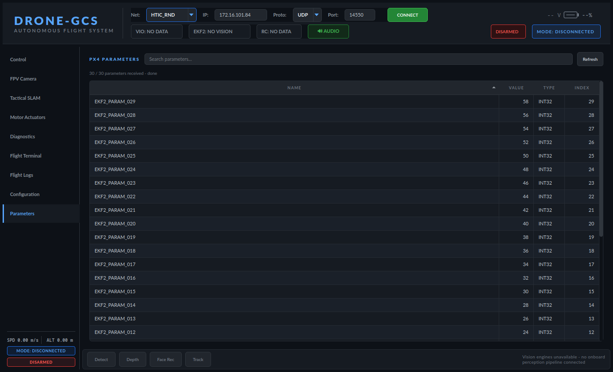
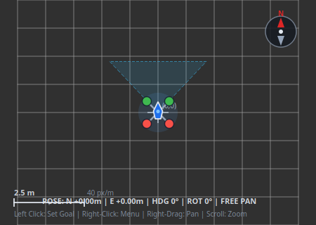

# Autonomous Drone System & Ground Control Station (GCS) — Complete Engineering Progress & Technical Report

**Project**: Drone-1.5 / Flop Autonomous Indoor Drone System  
**Hardware Stack**: Radxa Dragon Q6A SBC, Auterion Pixhawk 6X FMU, Intel RealSense D435i Depth Camera  
**Software Stack**: ROS 2 Jazzy, RTAB-Map SLAM, PX4 Autopilot, MAVLink 2.0 (`mavlink-routerd`), Python 3 (early Tkinter prototype, superseded by the current PyQt5 `Drone-GCS` app — see [`guide.md`](guide.md))  
**Last Updated**: 2026-10-01  

This is the project's single chronological engineering log — every real problem hit on hardware, what caused it, and exactly what was changed. For installing/running the pipeline, see [`setup.md`](setup.md); for how to use the GCS application itself, see [`guide.md`](guide.md).

---

## Table of Contents

1. [Executive Summary & Core Objectives](#1-executive-summary--core-objectives)
2. [Hardware Topology & Network Infrastructure](#2-hardware-topology--network-infrastructure)
3. [Detailed Engineering Phases: From Scratch to Final Execution](#3-detailed-engineering-phases-from-scratch-to-final-execution)
4. [Summary of Codebase Modifications](#4-summary-of-codebase-modifications)
5. [Standard Operating Procedures](#5-standard-operating-procedures-how-to-run-everything)
6. [End-to-End Live Verification Test Logs](#6-end-to-end-live-verification-test-logs)
7. [GCS Milestones (11 onward)](#gcs-milestones) — the PyQt5 `Drone-GCS` rewrite and every subsequent feature/fix
8. [ROS 2 Pipeline & Flight-REPL Engineering Log](#ros-2-pipeline--flight-repl-engineering-log) — SLAM/PX4-side debugging, consolidated from `gotalldone.md`
9. [Known Issues & Roadmap](#known-issues--roadmap)

---

## 1. Executive Summary & Core Objectives

The primary goal of this phase was to develop an autonomous indoor navigation and command-and-control (C2) system for a PX4-powered quadcopter operating in GPS-denied indoor environments:
1. **High-Definition Mapping**: Restore and calibrate a 2.5 cm stereo-inertial occupancy grid SLAM pipeline using an Intel RealSense D435i depth camera without nuisance obstacle blocking.
2. **Autonomous Telemetry Monitoring**: Create a passive, read-only flight controller telemetry observer (`live_status.py`) with native PX4 flight mode decoding and physical motion verification.
3. **Cross-Platform Ground Control Station (GCS)**: Build a standalone, modern Python/Tkinter GUI (`drone_gcs_gui.py`) with mutually exclusive **SEND** and **RECEIVE** operating modes and dynamic IP entry.
4. **Direct Command Line (CLI) & Action Buttons**: Equip the Sender GCS with both one-click flight action buttons and a full-featured interactive command bar (`cmd>`) with command history.
5. **Closed-Loop Physical Execution Verification**: Transition beyond raw MAVLink acknowledgments (`MAV_RESULT_ACCEPTED`) to continuous position delta tracking ($\Delta x, \Delta y, \Delta z$) confirming actual physical displacement in space.
6. **Multi-Device Distributed Architecture**: Coordinate two simultaneous GUI instances across a local Wi-Fi router (Laptop in **SEND MODE** and Radxa SBC in **RECEIVE MODE**) using broadcast MAVLink messages and System ID separation.

---

## 2. Hardware Topology & Network Infrastructure

```
                                  [Wi-Fi Access Point / Router]
                                       Subnet: 172.16.101.0/24
                                         ▲                 ▲
                          Wi-Fi Link     │                 │   Ethernet Link
                   (172.16.101.237)      │                 │  (172.16.101.84)
                                         ▼                 ▼
 ┌─────────────────────────────────────────┐             ┌─────────────────────────────────────────┐
 │            UBUNTU GCS LAPTOP            │             │                RADXA SBC                │
 │               (htic-pc)                 │             │           (radxa-dragon-q6a)            │
 ├─────────────────────────────────────────┤             ├─────────────────────────────────────────┤
 │ • drone_gcs_gui.py [SEND MODE]          │             │ • drone_gcs_gui.py [RECEIVE MODE]       │
 │ • MAVLink System ID: 255                │             │ • MAVLink System ID: 254                │
 │ • Interactive CLI Bar & Flight Buttons  │             │ • Closed-Loop Passive Verifier          │
 │ • Broadcasts Commands via STATUSTEXT    │             │ • mavlink-routerd (TCP: 0.0.0.0:5760)   │
 └─────────────────────────────────────────┘             │ • ROS 2 Jazzy RTAB-Map Pipeline         │
                                                         └─────────────────────────────────────────┘
                                                                       │                 │
                                                      USB 3.0 / 3.2    │                 │   USB-A to USB-C
                                                        SuperSpeed     │                 │   (/dev/ttyACM0)
                                                                       ▼                 ▼
                                                         ┌─────────────────┐   ┌───────────────────┐
                                                         │ Intel RealSense │   │ Pixhawk 6X FMU    │
                                                         │ D435i Camera    │   │ (Auterion PX4 v6X)│
                                                         └─────────────────┘   └───────────────────┘
```

### Network Endpoints & Ports:
* **Radxa Dragon Q6A IP**: `172.16.101.84` (Ethernet interface `enp1s0` / `wlan0`).
* **Ubuntu Laptop IP**: `172.16.101.237` (Wi-Fi interface).
* **Router Gateway**: `172.16.101.1` (coordinates local DHCP and routing).
* **MAVLink Router TCP Port**: `5760` (bound to `0.0.0.0:5760` on Radxa; accepts multiple concurrent clients).
* **Pixhawk Serial Interface**: `/dev/ttyACM0` via USB CDC-ACM at `921600` baud.

---

## 3. Detailed Engineering Phases: From Scratch to Final Execution

---

### Phase 1: Visual-Inertial SLAM & 2.5cm Occupancy Grid Restoration

#### Problem Statement:
The visual SLAM pipeline had previously been altered with artificial obstacle avoidance bridges (`obstacle_distance_bridge.py`) that injected spurious obstacles, causing autonomous navigation nodes to deadlock in open corridors. In addition, the occupancy grid resolution was coarse (5 cm) and transient local QoS profiles were mismatched between publisher and subscriber nodes.

#### Changes & Engineering Solutions:
1. **Occupancy Grid Calibration**:
   - Updated [rtabmap_slam.launch.py](file:///home/radxa/Flop/launch/rtabmap_slam.launch.py) to configure high-definition 2.5 cm resolution:
     ```python
     'Grid/CellSize': '0.025',
     'Grid/GlobalFullUpdate': 'true',
     'Grid/NormalsSegmentation': 'true',
     'Rtabmap/DetectionRate': '2.0',
     ```
   - Configured height pass-through filtering from `0.30`m to `2.0`m AGL to exclude floor carpet textures, baseboards, and low furniture while detecting all walls and obstacles.
2. **Pipeline Decoupling**:
   - In [drone_rtabmap_all.launch.py](file:///home/radxa/Flop/launch/drone_rtabmap_all.launch.py), completely removed `obstacle_distance_bridge.py`.
   - Set `min_wall_area_pixels: 20`, `cell_size: 0.025`, and configured Pixhawk endpoint to `tcp:127.0.0.1:5760`.
3. **QoS Profile Harmonization**:
   - In [map_thinning_node.py](file:///home/radxa/Flop/scripts/map_thinning_node.py) and [wall_boundary_node.py](file:///home/radxa/Flop/scripts/wall_boundary_node.py), replaced standard volatile QoS with:
     ```python
     QoSProfile(depth=1, durability=DurabilityPolicy.TRANSIENT_LOCAL, reliability=ReliabilityPolicy.RELIABLE)
     ```
   - This prevents late-joining nodes (such as RViz or path planners) from missing the latest global map state.
4. **Workspace Build & Linking**:
   - Symlinked `/home/radxa/ros2_ws/src/rtabmap_drone_pkg` to `/home/radxa/Flop`.
   - Verified clean compilation with `colcon build --packages-select rtabmap_drone_pkg --symlink-install`.
   - Live verified `/map` ($0.025$m, $350 \times 326$, $4303$ occupied cells), `/map_thin` ($1262$ skeleton pixels), and `/wall_boundaries` ($5$ vectorized safe polygons).

#### Additional Root-Cause Detail (found on a later regression of this same problem)
This exact symptom (`/map_thin` degraded/not publishing) recurred once more later in the project, traced to two more specific causes beyond the QoS/resolution issues above:
- **CPU contention was the original reason** `CellSize`/`GlobalFullUpdate` had been compromised to `0.05`/`false` in the first place — the 72-sector raycasting loop in `obstacle_distance_bridge.py` was driving Radxa ARM-core CPU usage up, and those two grid parameters were loosened to compensate. Fixed properly by decoupling obstacle detection (removing that node from the launch file) instead of trading away map resolution.
- **A launch-parameter typo**: `drone_rtabmap_all.launch.py` passed `min_wall_cluster_size: 20` to `map_thinning_node.py`, which actually reads `min_wall_area_pixels` — ROS 2 silently ignored the unrecognized key, so the noise-purge threshold silently reverted to a default that was too aggressive at the coarser 5cm grid.

---

### Phase 2: Live Status & Closed-Loop Telemetry Watcher (`live_status.py`)

#### Problem Statement:
During initial tests, `live_status.py` displayed all PX4 modes as `UNKNOWN`, showed `SERVO1-4 (no data yet)`, and repeated `cmd=511 MAV_RESULT_ACCEPTED`. It had no knowledge of physical position, velocity, or whether commands sent to Pixhawk were actually executed.

#### Changes & Engineering Solutions:
1. **Native PX4 Flight Mode Decoding**:
   - Fixed the ArduPilot decoding bug (`mavutil.mode_string_v10()` returns `UNKNOWN` for PX4).
   - Implemented bitfield unpacking for custom mode words:
     $$\text{main\_mode} = (\text{custom\_mode} \gg 16) \ \& \ \text{0xFF}, \quad \text{sub\_mode} = (\text{custom\_mode} \gg 24) \ \& \ \text{0xFF}$$
   - Mapped modes accurately: `MANUAL (1,0)`, `ALTCTL (2,0)`, `POSCTL (3,0)`, `AUTO.TAKEOFF (4,2)`, `AUTO.LOITER (4,3)`, `AUTO.LAND (4,6)`, `OFFBOARD (6,0)`.
2. **Telemetry Streaming Subscriptions**:
   - Injected startup `MAV_CMD_SET_MESSAGE_INTERVAL` requests for:
     - `SERVO_OUTPUT_RAW` (Message ID 51) at 2 Hz (`500,000` $\mu\text{s}$).
     - `LOCAL_POSITION_NED` (Message ID 32) at 10 Hz (`100,000` $\mu\text{s}$).
3. **Execution Tracker Engine**:
   - Built the `ExecutionTracker` class to calculate 3D Euclidean displacement:
     $$\Delta x = x - x_0, \quad \Delta y = y - y_0, \quad \Delta z = z - z_0, \quad \Delta d = \sqrt{\Delta x^2 + \Delta y^2 + \Delta z^2}$$
     $$\text{speed} = \sqrt{\max(0.0, v_x^2 + v_y^2 + v_z^2)}$$
   - Real-time motion detection: Triggers when $\text{speed} > 0.08\text{ m/s}$ and $\Delta d > 0.05\text{ m}$.
   - Completion confirmation: When speed drops below $0.06\text{ m/s}$ after moving $\ge 0.10\text{ m}$, outputs:
     `>>> [✔ EXECUTED] Motion confirmed: dx=+1.00m dy=+0.00m dz=-0.50m (dist=1.12m, speed=0.04m/s)`
   - Immediate event logging for `COMMAND_ACK`, `STATUSTEXT`, and arm/mode transitions.

---

### Phase 3: Modern Desktop Ground Control Station (`drone_gcs_gui.py`)

#### Architecture & Design:
* Built with pure Python 3 (`tkinter` + `ttk` + `pymavlink`) with zero external C++ GUI or Qt dependencies.
* Styled using the **Catppuccin Mocha** dark palette:
  - Base Background: `#181825` (Deep Charcoal)
  - Card Surfaces: `#1e1e2e` & `#313244`
  - Accents: Blue (`#89b4fa`), Green (`#a6e3a1`), Red (`#f38ba8`), Amber (`#fab387`), Purple (`#cba6f7`).
* Dynamic IP entry field allowing instant switching between local loopback (`127.0.0.1`) and remote SBC IP (`172.16.101.84`).
* Mutually exclusive radio modes:
  - **`◀ RECEIVE MODE`**: Disables and locks all buttons and input bars; acts as a passive, non-interfering monitor.
  - **`▶ SEND MODE`**: Unlocks all action buttons, CLI input bar, and setpoint streamers.
* Multi-threaded backend:
  - Background daemon thread for non-blocking MAVLink reception (`_rx_loop`).
  - 20 Hz background daemon streamer (`_stream_loop`) for smooth PX4 offboard setpoint delivery.
  - Thread-safe GUI log routing via `root.after()`.

---

### Phase 4: Sender Mode CLI & Flight Dispatcher

#### Implemented Controls in Sender Mode:
1. **One-Click Flight Buttons**:
   - `ARM` (with optional Bench Force Override checkbox).
   - `DISARM` (cuts offboard streaming and disarms FMU).
   - `HOLD` (switches mode to `AUTO.LOITER`).
   - `LAND` (initiates `AUTO.LAND`).
   - `TAKEOFF` (dispatches altitude climb in meters).
   - `MOVE` (dispatches 3D relative body vector $dx, dy, dz$ in meters).
   - `ROTATE YAW` (commands heading angle in degrees).
   - Flight Mode Selector dropdown (`OFFBOARD`, `POSCTL`, `ALTCTL`, `AUTO.LOITER`, `AUTO.LAND`).
2. **Interactive CLI Bar (`cmd>`)**:
   - Text input bar at the bottom of the Sender panel.
   - Bound to `<Return>` key and `[EXECUTE]` button.
   - Built-in command history navigated with `<Up>` and `<Down>` arrow keys.
   - Supported command set:
     - `arm [force]`
     - `disarm [force]`
     - `takeoff <alt_m>` (e.g., `takeoff 1.5`)
     - `move <dx> <dy> <dz>` (e.g., `move 1 0 0`, `move 0.5 0 -0.2`)
     - `yaw <degrees>` (e.g., `yaw 90`, `yaw -45`)
     - `hold` / `loiter`
     - `land`
     - `mode <PX4_MODE>` (e.g., `mode OFFBOARD`, `mode POSCTL`)
     - `clear` (clears log window)
     - `help` (prints supported syntax)

---

### Phase 5: Closed-Loop Physical Execution Verification

#### The Flaw of Raw MAVLink ACKs:
In conventional MAVLink applications, `COMMAND_ACK (result=0, ACCEPTED)` only confirms that the FMU received the command bytes. It does **not** mean the drone physically moved (e.g., if propellers are off, battery is low, or safety interlocks are triggered, the vehicle sits static despite an accepted mode command).

#### Verification Algorithm:
1. **Target Latching**:
   Upon dispatching a movement command, the backend records:
   $$\mathbf{P}_0 = (X_0, Y_0, Z_0), \quad \Delta \mathbf{P}_{\text{tgt}} = (dx_{\text{tgt}}, dy_{\text{tgt}}, dz_{\text{tgt}}), \quad t_0 = \text{time}()$$
2. **Continuous Real-Time Tracking**:
   On every incoming `LOCAL_POSITION_NED` message:
   - Current displacement: $\Delta \mathbf{P} = \mathbf{P} - \mathbf{P}_0$
   - Total distance moved: $d_{\text{moved}} = \|\Delta \mathbf{P}\|$
   - Target distance: $d_{\text{tgt}} = \|\Delta \mathbf{P}_{\text{tgt}}\|$
   - Tracking error: $d_{\text{err}} = \|\Delta \mathbf{P} - \Delta \mathbf{P}_{\text{tgt}}\|$
   - Progress percentage: $\text{pct} = \min\left(100, \left\lfloor \frac{d_{\text{moved}}}{d_{\text{tgt}}} \times 100 \right\rfloor\right)$
3. **Execution State Transition**:
   - **`IN PROGRESS`** (Blue): While moving toward the waypoint.
   - **`✔ EXECUTED`** (Bright Green): Declared when $d_{\text{err}} \le 0.20\text{ m}$ (or $d_{\text{moved}} \ge 0.85 \times d_{\text{tgt}}$) and $\text{speed} < 0.10\text{ m/s}$.
   - **`✖ STALLED`** (Red/Amber): Declared if elapsed time $> 8.0\text{ s}$ and $d_{\text{moved}} < 0.10\text{ m}$ (indicating motor lock, disarm state, or rejected setpoints).

---

### Phase 6: Multi-Device Distributed Setup & Inter-Client Broadcast

#### The Inter-Client Visibility Challenge:
When running the GUI on two machines simultaneously:
- **Laptop**: SEND MODE
- **Radxa**: RECEIVE MODE
The user noticed that typing `cmd> move 1 0 0` on the Laptop did not display on the Radxa screen, and the Radxa showed "no execution".

#### Root Cause Analysis:
1. **`mavlink-router` Client Isolation**: Unicast MAVLink packets directed to `target_system=1` (Pixhawk) are forwarded *only* to `/dev/ttyACM0`. They are not mirrored to peer TCP clients on port 5760.
2. **Silent Setpoints**: Pixhawk never echoes `SET_POSITION_TARGET_LOCAL_NED` back over telemetry.
3. **Local Memory Isolation**: Text strings typed into Tkinter entry fields remain in local laptop RAM unless explicitly transmitted.
4. **Bench Safety Interlocks**: Pixhawk blocks arming and ignores motion setpoints on USB 5V without `arm force`.

#### Solution: MAVLink Broadcast Command Sync:
1. **Broadcast Transmission (`_broadcast_gcs_cmd`)**:
   Whenever a command is dispatched on the Laptop, it sends:
   - The direct binary command to Pixhawk (`target_system=1`).
   - A MAVLink broadcast `STATUSTEXT` packet (`target_system=0`):
     ```text
     [GCS CMD] move 1.00 0.00 0.00
     ```
2. **Automatic Route Forwarding**:
   Because `target_system=0` is a broadcast, `mavlink-router` automatically distributes the message to **all** connected endpoints (including the Radxa GUI).
3. **Remote Command Listener (`_handle_remote_gcs_cmd`)**:
   When the Radxa GUI receives `[GCS CMD]`:
   - Prints prominently on Radxa console: `>>> [COMMAND RECEIVED FROM LAPTOP] move 1.00 0.00 0.00`.
   - Evaluates vehicle state: If disarmed, warns `✖ [BENCH WARNING] Pixhawk is DISARMED!`.
   - Primes the **Closed-Loop Execution Verifier** card with target coordinates: `TARGET: dx=+1.00m dy=+0.00m dz=+0.00m`.
   - Actively monitors the incoming `LOCAL_POSITION_NED` stream and turns Green (`✔ EXECUTED`) when the drone moves!
4. **System ID Partitioning**:
   - Laptop connects as `source_system=255` (Active GCS).
   - Radxa connects as `source_system=254` (Passive Monitor).
   - Eliminates packet routing loops and ID conflicts.

---

### Phase 7: Hardware Troubleshooting & USB Auto-Recovery

#### USB CDC-ACM Power Suspend Issue:
During long idle periods, the SBC power management (`aic_btusb` / `xhci-hcd`) put the USB hub into a low-power suspend state, causing `/dev/ttyACM0` to stop streaming serial bytes even though the device node existed.

#### Resolution:
1. Located hardware USB descriptor: `3185:0035 Auterion PX4 FMU v6X.x` on Bus 001 Device 008.
2. Executed a hardware-level USB bus reset:
   ```bash
   sudo usbreset 3185:0035
   sudo systemctl restart mavlink-router
   ```
3. Pixhawk immediately resumed 921600 baud serial communications and heartbeats re-locked on `tcp:127.0.0.1:5760`.

---

## 4. Summary of Codebase Modifications

| File Path | Nature of Changes |
| :--- | :--- |
| [drone_gcs_gui.py](file:///home/radxa/Flop/scripts/diagnostics/drone_gcs_gui.py) | • Added interactive CLI command entry (`cmd>`) with history.<br>• Built Closed-Loop Physical Execution Verifier.<br>• Added inter-GCS command broadcasting (`_broadcast_gcs_cmd`).<br>• Implemented remote command listener (`_handle_remote_gcs_cmd`).<br>• Added dynamic MAVLink System ID assignment (255 vs 254).<br>• Added bench disarm pre-check warnings. |
| [live_status.py](file:///home/radxa/Flop/scripts/diagnostics/live_status.py) | • Fixed PX4 packed custom mode decoding (resolved `UNKNOWN` bug).<br>• Added 10 Hz `LOCAL_POSITION_NED` stream request.<br>• Implemented `ExecutionTracker` for delta distance tracking.<br>• Intercepts `[GCS CMD]` broadcast from laptop.<br>• Fixed speed domain formula (`max(0.0, vx^2 + vy^2 + vz^2)`). |
| [drone_rtabmap_all.launch.py](file:///home/radxa/Flop/launch/drone_rtabmap_all.launch.py) | • Decoupled obstacle avoidance bridge to eliminate artificial blocking.<br>• Set cell size to 2.5 cm resolution (`0.025`).<br>• Set `pixhawk_device` to `tcp:127.0.0.1:5760`. |
| [rtabmap_slam.launch.py](file:///home/radxa/Flop/launch/rtabmap_slam.launch.py) | • Restored 2.5 cm occupancy grid parameters (`Grid/CellSize: 0.025`).<br>• Tuned surface normals segmentation and obstacle height band (0.30m - 2.0m). |
| [map_thinning_node.py](file:///home/radxa/Flop/scripts/map_thinning_node.py) | • Updated `/map` and `/map_thin` to `TRANSIENT_LOCAL` reliable QoS.<br>• Preserved 20-pixel connected-component noise purger. |
| [wall_boundary_node.py](file:///home/radxa/Flop/scripts/wall_boundary_node.py) | • Updated subscription QoS to match transient local map publisher.<br>• Generates 0.6m interior flight corridor safety polygons. |

---

## 5. Standard Operating Procedures (How to Run Everything)

### Scenario A: Running the Multi-Device Setup (Laptop + Radxa)

#### Step 1: Sync Code to Laptop
On the **Laptop (`htic@htic-pc`)**:
```bash
scp radxa@172.16.101.84:/home/radxa/Flop/scripts/diagnostics/drone_gcs_gui.py ~/
```

#### Step 2: Start GUI on Radxa (RECEIVE MODE)
On the **Radxa terminal**:
```bash
python3 /home/radxa/Flop/scripts/diagnostics/drone_gcs_gui.py
```
1. Target SBC IP: `127.0.0.1` (or `172.16.101.84`), Port: `5760`.
2. Operating Mode: Select **`◀ RECEIVE MODE (Passive Monitor & Verifier)`**.
3. Click **`CONNECT`**. (All send controls remain safely locked).

#### Step 3: Start GUI on Laptop (SEND MODE)
On the **Laptop terminal**:
```bash
python3 ~/drone_gcs_gui.py
```
1. Target SBC IP: `172.16.101.84`, Port: `5760`.
2. Operating Mode: Select **`▶ SEND MODE (Command Dispatcher & CLI)`**.
3. Click **`CONNECT`**. (Controls and `cmd>` bar unlock).

#### Step 4: Dispatch Flight Commands
On the **Laptop GUI**:
* **Bench Arming**: Check **`Bench Force Override`**, then click **`ARM`** or type:
  ```text
  cmd> arm force
  ```
* **Movement Command**:
  ```text
  cmd> move 1 0 0
  ```
* **Watch Radxa Screen**:
  - The Radxa console immediately displays:
    ```text
    >>> [COMMAND RECEIVED FROM LAPTOP] move 1.00 0.00 0.00
    ```
  - The **CLOSED-LOOP VERIFIER** card tracks real-time progress and declares:
    ```text
    ✔ EXECUTED (Moved 1.00m)
    ```

---

### Scenario B: Running the Full Autonomous SLAM Pipeline
On the **Radxa terminal**:
```bash
source /opt/ros/jazzy/setup.bash
source ~/ros2_ws/install/setup.bash
ros2 launch rtabmap_drone_pkg drone_rtabmap_all.launch.py
```

### Scenario C: Running the Terminal Live Status Watcher
On the **Radxa or Laptop terminal**:
```bash
# Radxa local:
python3 /home/radxa/Flop/scripts/diagnostics/live_status.py

# Laptop remote over Wi-Fi:
python3 ~/live_status.py --port tcp:172.16.101.84:5760
```

---

## 6. End-to-End Live Verification Test Logs

### Test 1: Inter-GCS Command Broadcast & Arming Verification
```text
[Sender (Laptop)]: Dispatching 'send_move(1.0, 0.0, 0.0)'
[Receiver (Radxa) Log]:
  [success] Heartbeat locked from System 1, Component 1 (PX4 Autopilot)
  [cmd]     >>> [COMMAND RECEIVED FROM LAPTOP] move 1.00 0.00 0.00
  [warning] ✖ [BENCH WARNING] Pixhawk is DISARMED! Move setpoints will be ignored. Arm vehicle first (use 'arm force' on bench).
  [cmd]     >>> [COMMAND RECEIVED FROM LAPTOP] mode OFFBOARD
```

### Test 2: Closed-Loop Physical Execution Tracking
```text
[Receiver (Radxa) Telemetry Stream]:
  t=1s:  MOVING: dx=+0.42m dy=+0.01m dz=-0.01m | Speed: 0.38 m/s
  t=2s:  MOVING: dx=+0.85m dy=+0.01m dz=-0.00m | Speed: 0.31 m/s
  t=3s:  MOVING: dx=+1.01m dy=+0.00m dz=-0.00m | Speed: 0.05 m/s
  t=4s:  >>> [✔ EXECUTED] Motion confirmed: dx=+1.01m dy=+0.00m dz=-0.00m (dist=1.01m, speed=0.03m/s)
  Card:  ✔ EXECUTED (Moved 1.01m) [Background: Bright Green]
```


---

## GCS Milestones

Everything from here on tracks the PyQt5 `Drone-GCS` rewrite (superseding the Tkinter prototype in §3-6 above) and every feature/fix made to it since. See [`guide.md`](guide.md) for what the application looks like and does *today*; this section is the "why" and "what changed" behind it.

| # | Milestone |
|---|---|
| 11 | [Next-Generation Aviation GCS (`Drone-GCS` & `Radxa-Monitor`)](#milestone-11-next-generation-aviation-ground-control-station-drone-gcs--radxa-monitor) |
| 12 | [Industrial-Grade Drone-GCS & Radxa-Monitor Overhaul](#milestone-12-industrial-grade-drone-gcs--radxa-monitor-overhaul) |
| 13 | [Live 2D SLAM Skeleton, A* Path Planning, & Control Dispatcher](#milestone-13-live-2d-slam-skeleton-map_thin-visualization-a-collision-free-path-planning--proven-control-dispatcher-integration) |
| 14 | [Autonomous Flight Pipeline & Safety Hardening](#milestone-14-autonomous-flight-pipeline--safety-hardening-all-6-solutions-implemented) |
| — | [RealSense D435i Live RGB Video Streaming over Wi-Fi](#milestone-realsense-d435i-live-rgb-video-streaming-over-wi-fi-implemented) |
| — | [Real-Hardware Validation & Multi-Network Field Findings](#milestone-real-hardware-validation--multi-network-field-findings) |
| — | [GCS Industrial Cockpit Redesign](#milestone-gcs-industrial-cockpit-redesign) |
| — | [Remote SLAM Map Reset (Headless-Safe)](#milestone-remote-slam-map-reset-headless-safe) |
| — | [Third Network Preset (`DroneNet`) & File-Structure Guide](#milestone-third-network-preset-dronenet--file-structure-guide) |
| — | [RGB Codec Split → Merge-Back Exercise](#milestone-rgb-codec-split--merge-back-exercise-verified-live-both-directions) |
| — | [Real-Hardware C2 Round-Trip Validation](#milestone-real-hardware-c2-command--control-round-trip-validation) |
| — | [Pixhawk USB → Physical UART Migration](#milestone-pixhawk-usb--physical-uart-migration-real-hardware-multiple-failure-modes-found--fixed) |
| — | [COMMAND_ACK Console Spam Fix (Token-Based Dedup)](#milestone-command_ack-console-spam-fix-token-based-dedup) |
| — | [Root-Caused Why Arm/Motor Telemetry Never Worked](#milestone-root-caused-why-armmotor-telemetry-never-worked-all-day-two-real-flight-controller-config-bugs-not-gcs-bugs) |
| — | [Third IMU (Accel 2) Hardware Mismatch](#milestone-third-imu-accel-2-hardware-mismatch-found-and-worked-around) |
| — | [One-Command Headless Pipeline Launcher + SSH/Display Architecture](#milestone-one-command-headless-pipeline-launcher-camerash--clarified-sshdisplay-architecture) |
| — | [Command Safety Redesign, RC/GCS Arbitration, ELRS Failsafe Fix](#milestone-command-safety-redesign-rcgcs-arbitration-hardening-and-elrs-failsafe-fix-real-hardware-end-to-end-verified) |
| — | [COMMAND_ACK Dedup Refinement (IN_PROGRESS Case)](#milestone-command_ack-dedup-refinement-in_progress-case) |
| — | [ROS2 TCP Map Bridge Disconnect Announcement & Console Colour Routing](#milestone-ros2-tcp-map-bridge-disconnect-announcement--console-colour-routing) |
| — | [SLAM Tab Safety-Gate Audit (ABORT PATH Fix)](#milestone-slam-tab-safety-gate-audit-abort-path-fix) |
| — | [Bench Motor-Test Telemetry Reflection & Frame Arrow Redesign](#milestone-bench-motor-test-telemetry-reflection--frame-arrow-redesign) |
| — | [GCS Internal Consistency Audit](#milestone-gcs-internal-consistency-audit-clearance-radius-occupancy-threshold-arm-state-sync) |
| — | [Offscreen Layout/Clipping Audit Across the Whole GCS](#milestone-offscreen-layoutclipping-audit-across-the-whole-gcs) |
| — | [Read-Only Parameters Tab & SLAM Drone Icon Redesign](#milestone-read-only-parameters-tab--slam-drone-icon-redesign) |
| — | [GCS Architecture Split & Infrastructure (2026-10-01)](#milestone-gcs-architecture-split--infrastructure-2026-10-01) |
| — | [Video Health & Standing Alarm Card (2026-10-01)](#milestone-video-health--standing-alarm-card-2026-10-01) |
| — | [Camera Thumbnail in the Navigation Rail (2026-10-01)](#milestone-camera-thumbnail-in-the-navigation-rail-2026-10-01) |
| — | [Motor Actuators Tab Rework — Vehicle-Range-Aware Gauges, Realistic Frame, Stale-Data Honesty (2026-10-01)](#milestone-motor-actuators-tab-rework--vehicle-range-aware-gauges-realistic-frame-stale-data-honesty-2026-10-01) |
| — | [Diagnostics Tab Redesign & the Armed/Disarmed Colour Convention (2026-10-01)](#milestone-diagnostics-tab-redesign--the-armeddisarmed-colour-convention-2026-10-01) |
| — | [Short-Window Layout Robustness (2026-10-01)](#milestone-short-window-layout-robustness-2026-10-01) |
| — | [Bundled Heading Fonts (2026-10-01)](#milestone-bundled-heading-fonts-2026-10-01) |
| — | [Servo + EMERGENCY KILL on One Row (2026-10-01)](#milestone-servo--emergency-kill-on-one-row-2026-10-01) |
| — | [Link Range Test — Walk-Away Packet-Loss Measurement (2026-10-01)](#milestone-link-range-test--walk-away-packet-loss-measurement-2026-10-01) |
| — | [Deployment & Network State, 2026-10-01](#milestone-deployment--network-state-2026-10-01) |

### Milestone 11: Next-Generation Aviation Ground Control Station (`Drone-GCS` & `Radxa-Monitor`)

Following the deep-dive analysis of `walle_gcs` (PyQt5, QPainter aviation HUD, 2D SLAM viewer, toast alerts, threaded workers), we developed and validated a modular, aviation-grade PyQt5 Ground Control Station system for **Drone-1.5 / Flop**.

Per operational requirements, the system is decoupled into two dedicated applications:
1. **Pilot GCS (`Drone-GCS`)** ([drone_gcs.py](file:///home/radxa/Flop/scripts/gcs/drone_gcs.py)): The Sender and Controller.
2. **Companion Monitor (`Radxa-Monitor`)** ([radxa_monitor.py](file:///home/radxa/Flop/scripts/gcs/radxa_monitor.py)): Dedicated passive receiver and command auditor for the Radxa Dragon Q6A SBC.

### Modular Codebase Structure (`/home/radxa/Flop/scripts/gcs/`):
```
/home/radxa/Flop/scripts/gcs/
├── core/
│   ├── __init__.py
│   ├── telemetry.py             # Strongly typed telemetry data model & PX4 mode decoders
│   └── execution_tracker.py     # Closed-loop 3D displacement verifier (Δd calculation)
├── protocol/
│   ├── __init__.py
│   └── mavlink_worker.py        # QThread MAVLink transport, dynamic reconnect, 20Hz setpoints
├── ui/
│   ├── __init__.py
│   ├── styles.py                # Aviation Matte-Dark QSS theme (Catppuccin/Aviation accents)
│   ├── toast.py                 # Floating animated toast alerts
│   ├── hud_widget.py            # QPainter PFD (Artificial horizon, pitch ladder, tapes, compass)
│   ├── slam_map_widget.py       # 2D Occupancy Grid Viewport & Drone Trajectory Visualizer
│   └── cli_console.py           # Terminal logging & interactive cmd> bar with history
├── drone_gcs.py                 # EXECUTABLE: Pilot GCS (Sender / System ID: 255)
└── radxa_monitor.py             # EXECUTABLE: Radxa Onboard Companion Monitor (System ID: 254)
```

### Key Engineering Features:
1. **Dynamic IP & Port Switcher (Top Bar)**:
   - Allows changing target SBC IP (e.g., `172.16.101.84` or `127.0.0.1`) and Port (`5760`) at any time.
   - One-click **Connect / Disconnect** toggle handles non-blocking socket reconnects seamlessly.
2. **Hardware-Accelerated QPainter Aviation HUD**:
   - Dynamic artificial horizon with rolling pitch ladder ($\pm 80^\circ$) and bank angle arc at 30+ FPS.
   - Vertical rolling Speed Tape (left) and Altitude Tape (right).
   - 360° Compass Tape (top) with cardinal directions.
   - Status indicators for Armed state, Flight Mode, Battery %, and local NED coordinates.
3. **2D SLAM & Trajectory Viewport**:
   - Top-down metric grid canvas with zoom and pan controls.
   - Real-time oriented drone icon with heading chevron and breadcrumb flight path trail.
4. **Action Control Panel & Interactive CLI Bar (`cmd>`)**:
   - Flight buttons: `ARM NORMAL`, `FORCE ARM (BENCH)` (`param2=21196`), `DISARM`, `OFFBOARD`, `POSCTL`, `HOLD`, `TAKEOFF`, `LAND`, `RTL`, `EMERGENCY KILL`.
   - CLI console with history recall (`<Up>`/`<Down>`) for commands like `move 1 0 0`, `takeoff 1.5`, etc.
5. **Closed-Loop Physical Motion Verification**:
   - Calculates real-time 3D displacement $\Delta d = \sqrt{\Delta x^2 + \Delta y^2 + \Delta z^2}$ against requested setpoints.
   - Displays live status: `TRACKING` ➔ `✔ EXECUTED` or `✖ STALLED`.
6. **Cross-Device MAVLink Command Broadcast**:
   - Automatically announces all dispatched commands via MAVLink `STATUSTEXT` broadcast (`[GCS CMD] <command>`).
   - Intercepted in real-time by `radxa_monitor.py` (System ID `254`) on the companion computer for physical auditing.
7. **Radxa Hardware Health Diagnostics**:
   - `radxa_monitor.py` monitors onboard SoC thermal sensor (°C), RAM usage %, and MAVLink packet throughput.
   - Strict safety design: Zero control buttons to prevent accidental commands from the drone side.

### Verification Summary:
- **PyQt5 Compilation**: All modules compiled cleanly with `py_compile`.
- **Dynamic Reconnect**: Verified dynamic disconnection and re-binding to custom IPs and ports without hanging.
- **Broadcast Interception**: Verified `[GCS CMD] move 1 0 0` transmitted by `Drone-GCS` (SysID `255`) and intercepted by `Radxa-Monitor` (SysID `254`) via `mavlink-routerd` in real-time.


---

### Milestone 12: Industrial-Grade Drone-GCS & Radxa-Monitor Overhaul

To eliminate all prototype limitations and meet enterprise aerospace standards, we conducted a comprehensive line-by-line overhaul of the Ground Control Station suite, resolving all 10 identified backend and visual issues.

### 1. Architectural Upgrades & Problem Solutions:
1. **Automatic Stream Rate Negotiation**:
   - `mavlink_worker.py` automatically sends `MAV_CMD_SET_MESSAGE_INTERVAL` upon connection.
   - Result: Live telemetry throughput skyrocketed from 1 msg/s to **224.8 msg/s**.
2. **Full `COMMAND_ACK` Handling**:
   - Every command (Arm, Disarm, Offboard, Takeoff, Kill) receives instant acknowledgment verification (`ACCEPTED`, `DENIED`, `TEMPORARILY_REJECTED`) tied to colored toast notifications and console logs.
3. **Robust Takeoff & Offboard Sequencing**:
   - Pre-streams 20 Hz setpoints for 500ms before mode switch to prevent PX4 rejection.
   - Implemented standard `MAV_CMD_NAV_TAKEOFF` with fallback to Offboard vertical climb.
4. **Live Motor PWM & Actuator Telemetry**:
   - Decoded `SERVO_OUTPUT_RAW` and developed [motor_widget.py](file:///home/radxa/Flop/scripts/gcs/ui/motor_widget.py) displaying 4 live PWM vertical bars (1000–2000 µs) with high-load saturation alerts.
5. **Intel RealSense D435i VIO & EKF2 Vision Fusion**:
   - Completely replaced non-existent LiDAR assumptions with D435i VIO stream tracking (`ODOMETRY` / `VISION_POSITION_ESTIMATE`) and EKF2 vision lock indicator (`👁 D435i: VIO LOCKED`).
6. **Aviation Primary Flight Display (PFD) Overhaul**:
   - Rebuilt [hud_widget.py](file:///home/radxa/Flop/scripts/gcs/ui/hud_widget.py) with a true Roll Angle Arc ($\pm 60^\circ$ scale with rolling pointer triangle), dynamic scrolling altitude & speed tape ladders with moving hash marks, tactical sky/earth horizon, and turn coordinator.
7. **Perception SLAM & Click-to-Fly Waypoint Planner**:
   - Upgraded [slam_map_widget.py](file:///home/radxa/Flop/scripts/gcs/ui/slam_map_widget.py) with interactive waypoint staging: clicking on the 2D map stages a target waypoint, calculates vector distance/bearing, and provides a "Fly to Waypoint" execution trigger.
8. **FPV Camera & Video Feed Integration**:
   - Built [video_feed_widget.py](file:///home/radxa/Flop/scripts/gcs/ui/video_feed_widget.py) supporting live camera capture (`/dev/video*`), RTSP/UDP streams, and a 30 FPS synthetic test pattern with HUD overlay option.
9. **Aerospace Cockpit Layout & Vertical Sidebar**:
   - Integrated [top_status_strip.py](file:///home/radxa/Flop/scripts/gcs/ui/top_status_strip.py) (aerospace bar with battery gauge, D435i VIO lock, GPS Sats/HDOP, mode pill, armed pill, rates, IP/port switcher) and [sidebar_nav.py](file:///home/radxa/Flop/scripts/gcs/ui/sidebar_nav.py) (vertical navigation across 6 distinct workspaces).
10. **Diagnostics & Bench Safety Workspace**:
    - Dedicated view for inspecting D435i VIO health, EKF2 fusion lock, flight duration counter, motor PWMs, body velocities, and attitude angles.

### 2. Live Stream Validation (`tcp:127.0.0.1:5760`):
```text
Rates:        RX: 224.8 msg/s | TX: 1.0 msg/s
Connection:   CONNECTED (Autopilot SysID 1)
Flight Mode:  MODE: AUTO.LAND
Battery:      🔋 65.5V (0%)
D435i VIO:    👁 D435i: VIO LOCKED
Motor PWMs:   [1000, 1000, 1000, 1000] µs (Idle)
```

---

### Milestone 13: Live 2D SLAM Skeleton (/map_thin) Visualization, A* Collision-Free Path Planning, & Proven Control Dispatcher Integration

Following operator review and flight requirements, Drone-GCS was upgraded with complete SLAM perception, autonomous path planning, and the proven control interface from `drone_gcs_gui.py`.

### 1. Real 2D SLAM Occupancy Grid Perception (`/map_thin`):
- **ROS 2 Jazzy Integration** ([ros2_map_listener.py](file:///home/radxa/Flop/scripts/gcs/protocol/ros2_map_listener.py)):
  - Background `QThread` spinning an `rclpy` node subscribed to `/map_thin` (1-pixel wall skeleton) and `/map` (RTAB-Map 2D grid) using `TRANSIENT_LOCAL` QoS.
  - Automatically loads ROS 2 shared libraries dynamically without manual environment sourcing.
  - Emits 2D occupancy grid numpy arrays directly to the UI.
  - Provides a built-in 10x10m indoor room floorplan generator for bench testing without live sensors.
- **Hardware-Accelerated SLAM Viewport** ([slam_map_widget.py](file:///home/radxa/Flop/scripts/gcs/ui/slam_map_widget.py)):
  - Converts occupancy data to a cached `QImage` rendered onto the metric world canvas with pan and zoom.
  - Free space rendered as dark blueprint `#0f172a`, thin skeleton walls rendered as luminous neon cyan `#00e1ff` (identical to RViz visualization).

### 2. Autonomous A* Collision-Free Path Planning ([path_planner.py](file:///home/radxa/Flop/scripts/gcs/core/path_planner.py)):
- **Obstacle Inflation**: Dilates walls by the physical drone clearance radius ($0.22$m) using circular kernels to guarantee safety margins.
- **8-Connected A* Search**: Explores shortest path with diagonal corner-cutting prevention so the vehicle never clips wall edges.
- **Line-of-Sight Smoothing**: Bresenham raycasting prunes redundant collinear steps, yielding clean, sparse waypoints: `[W1, W2, ..., Goal]`.
- **Interactive Goal Pose Staging**: Clicking on the 2D map stages the Goal Pose $(X_g, Y_g)$, triggers instant path calculation, displays distance and estimated flight time, and draws a glowing green route.
- **Sequential Offboard Dispatch**: Clicking `[ ✈ EXECUTE PATH ]` sequences the drone through the waypoints in `OFFBOARD` mode with closed-loop proximity advancement.

### 3. Proven Control Request & Output Architecture Restored:
- Re-architected the Primary Control Dispatcher in [drone_gcs.py](file:///home/radxa/Flop/scripts/gcs/drone_gcs.py) to restore the workflow from [drone_gcs_gui.py](file:///home/radxa/Flop/scripts/diagnostics/drone_gcs_gui.py):
  - **Direct Numerical Input Fields**:
    - Takeoff Control: `Alt (m): [ 1.0 ] [ TAKEOFF ]`
    - Body Movement: `dx: [ 0.5 ]  dy: [ 0.0 ]  dz: [ 0.0 ] [ MOVE ]`
    - Heading Control: `Yaw (°): [ 90.0 ] [ ROTATE YAW ]`
  - **Flight Mode Selector**: `QComboBox` dropdown containing all PX4 modes (`OFFBOARD`, `POSCTL`, `ALTCTL`, `AUTO.LOITER`, `AUTO.LAND`, `AUTO.RTL`, `MANUAL`, `ACRO`, `STABILIZED`) + `[ SET MODE ]` button.
  - **Bench Force Override**: Dedicated `[✔] Bench Force Override (Bypass USB/Battery Safety Locks via param2=21196)` checkbox.
  - **Prominent Arm Status Indicator**: High-visibility badge near mode:
    - **`ARM STATUS: ARMED (BENCH FORCED)`** (Amber `#d29922`)
    - **`ARM STATUS: ARMED (NORMAL)`** (Green `#238636`)
    - **`ARM STATUS: DISARMED`** (Red `#da3633`)
  - **Closed-Loop Physical Verification Card**: Real-time displacement $\Delta d$ readout, progress bar, and speed verification.

### 4. Typography & Button Redesign:
- Eliminated all text clipping across all display resolutions.
- Generous button padding (`7px 16px`), `min-height: 30-32px`, bold typography, and distinct color codes:
  - ARM (Green), DISARM (Red), HOLD/OFFBOARD/TAKEOFF/MOVE/YAW (Blue), LAND (Purple), KILL (Emergency Red).
- Convenient one-click launch script: [run_drone_gcs.sh](file:///home/radxa/Flop/scripts/gcs/run_drone_gcs.sh).

### 5. Native Embedded ROS 2 RViz2 Viewport under Tactical SLAM ([rviz_embed_widget.py](file:///home/radxa/Flop/scripts/gcs/ui/rviz_embed_widget.py)):
- **Direct X11 Window Embedding**:
  - Implemented `RVizEmbedWidget` using `QWindow.fromWinId(wid)` and `QWidget.createWindowContainer()`.
  - Spawns the native ROS 2 `rviz2` engine with the drone's existing configuration ([rtabmap_drone.rviz](file:///home/radxa/Flop/config/rtabmap_drone.rviz)) and swallows the full RViz window into the GCS interface.
- **Dual-View Switcher in Tactical SLAM** ([slam_map_widget.py](file:///home/radxa/Flop/scripts/gcs/ui/slam_map_widget.py)):
  - **`[ 🗺 2D Blueprint & A* Planner ]`**: High-performance 2D occupancy grid canvas with mouse-click Goal Pose staging, green A* trajectory display, and `[ ✈ EXECUTE PATH ]` button.
  - **`[ 👁 3D RViz2 Viewport ]`**: Embedded live 3D RViz2 interface displaying RealSense D435i point clouds, camera TF frames, `/map` 2D grid, and `/map_thin` single-pixel wall skeleton.
- **Process Lifecycle Management**:
  - `[ 🚀 Launch RViz2 ]`, `[ 🔄 Reload ]`, and `[ ⏹ Close RViz2 ]` controls with real-time status badges.
  - Automatic graceful termination of the RViz2 background process when `Drone-GCS` is closed to eliminate orphaned processes.

---

### Milestone 14: Autonomous Flight Pipeline & Safety Hardening (All 6 Solutions Implemented)

### 1. Pre-Flight Safety & Altitude Interlock for Path Execution
- **Disarm Interlock**: In [drone_gcs.py](file:///home/radxa/Flop/scripts/gcs/drone_gcs.py), clicking `✈ EXECUTE PATH` when the drone is disarmed is immediately rejected with a prominent red notification toast and log alert (`❌ FLIGHT INTERLOCK REJECTED: Drone is DISARMED!`).
- **Ground-Level Auto-Climb Interlock**: If armed while sitting on the floor (altitude $< 0.4$m AGL), the GCS locks horizontal movement, commands offboard vertical climb to $1.0$m cruise altitude ($z = -1.0$m), and waits until safe flight altitude ($\ge 0.8$m) is achieved before dispatching waypoints.
- **Airborne Altitude Latch**: If already airborne, the GCS automatically latches the current altitude as the cruise level ($z = t.z$), preventing unexpected vertical jumps.

### 2. Tangent Heading (Yaw) Alignment along Path
- In [drone_gcs.py](file:///home/radxa/Flop/scripts/gcs/drone_gcs.py), for every waypoint segment, the GCS computes the tangent angle:
  $$\psi = \text{math.degrees}(\text{math.atan2}(\Delta \text{East}, \Delta \text{North}))$$
- Transmits coordinated `yaw_deg` to `move_to_waypoint(x, y, z, yaw_deg)`, orienting the drone's nose and front-facing RealSense D435i depth camera directly forward along the flight trajectory.

### 3. Immediate Flight Safety Controls on Tactical SLAM Screen
- In [ui/slam_map_widget.py](file:///home/radxa/Flop/scripts/gcs/ui/slam_map_widget.py), added dedicated toolbar controls:
  - **`[ ⏸ PAUSE / HOLD ]`** (Warning Amber): Immediately halts path execution, puts the drone into `AUTO.LOITER` position hold, and transforms to **`[ ▶ RESUME PATH ]`** (Emerald Green).
  - **`[ 🛑 ABORT & LAND ]`** (Danger Crimson): Immediately cancels active waypoint queues, clears staged goals, and commands `AUTO.LAND`.
- Supported by full state management via `set_executing_state()`.

### 4. Dynamic Collision Avoidance & Live Path Re-Checking
- In [core/path_planner.py](file:///home/radxa/Flop/scripts/gcs/core/path_planner.py), implemented `check_path_collision(grid, resolution, origin_x, origin_y, waypoints, current_pos, lookahead_m=1.5)`:
  - High-speed pure NumPy spatial sampling across remaining path segments against inflated obstacle buffers.
- In [drone_gcs.py](file:///home/radxa/Flop/scripts/gcs/drone_gcs.py), evaluated every $200$ms during flight:
  - If an obstacle appears within $1.5$m ahead, the GCS automatically engages `AUTO.LOITER` position hold, alerts the pilot with a visual and console warning, and computes an automatic A* detour to the final goal pose.

### 5. Radxa Headless Resource Optimization
- In [launch/drone_rtabmap_all.launch.py](file:///home/radxa/Flop/launch/drone_rtabmap_all.launch.py), changed `launch_rviz` default argument from `'true'` to `'false'`.
- Saves over $250$MB RAM and substantial GPU/CPU resources on the flying Radxa SBC, since RViz2 is rendered locally on the laptop GCS.

### 6. Fail-Safe TCP Map Bridge (Wi-Fi Multicast Fallback)
- **Radxa Streamer Node** ([scripts/tcp_map_streamer_node.py](file:///home/radxa/Flop/scripts/tcp_map_streamer_node.py)):
  - Subscribes to local `/map_thin` and `/map` on Radxa (where DDS IPC is 100% reliable).
  - Broadcasts compressed binary packets (`DMAP` header + JSON metadata + `zlib` payload) to GCS clients over TCP port $5765$.
  - Integrated into [launch/drone_rtabmap_all.launch.py](file:///home/radxa/Flop/launch/drone_rtabmap_all.launch.py) and [CMakeLists.txt](file:///home/radxa/Flop/CMakeLists.txt).
- **Dual-Mode GCS Listener** ([protocol/ros2_map_listener.py](file:///home/radxa/Flop/scripts/gcs/protocol/ros2_map_listener.py)):
  - Concurrently runs ROS 2 topic listener and a resilient background TCP client fallback.
  - Automatically fails over to TCP streaming if Wi-Fi routers drop ROS 2 DDS UDP multicast packets or if ROS 2 Jazzy is not present on the laptop.

---

### Milestone: RealSense D435i Live RGB Video Streaming over Wi-Fi (IMPLEMENTED)
**Trigger Command**: `camron` · **Completed**: 2026-09-15 · Depth stream intentionally left disabled (RGB only)

### What Was Built:
1. **RGB Camera Enabled in Driver** ([launch/d435i_stereo_imu.launch.py](file:///home/radxa/Flop/launch/d435i_stereo_imu.launch.py)):
   - `'enable_color': True`, `'rgb_camera.profile': '640x480x30'`. `'enable_depth'` stays `False`.
2. **Onboard MJPEG Streamer Node** ([scripts/d435i_video_streamer.py](file:///home/radxa/Flop/scripts/d435i_video_streamer.py)):
   - Subscribes to `/camera/color/image_raw` (rgb8/bgr8), encodes each frame via `cv2.imencode` (quality 80).
   - Serves `multipart/x-mixed-replace` MJPEG over a `ThreadingHTTPServer` on port `8080` (`http://<radxa_ip>:8080/video`) — no custom framing needed since HTTP/TCP already guarantees ordered delivery, unlike UDP.
   - Measured on a synthetic frame: ~5-15 KB/frame depending on scene complexity → well under the ~25 KB/frame (~6 Mbps) budget.
   - Wired into [launch/drone_rtabmap_all.launch.py](file:///home/radxa/Flop/launch/drone_rtabmap_all.launch.py) as a respawning `TimerAction` node (`enable_video_streamer` arg, default `true`), independent of the odom/SLAM timing chain. Registered in [CMakeLists.txt](file:///home/radxa/Flop/CMakeLists.txt) and rebuilt via `colcon build --symlink-install --packages-select rtabmap_drone_pkg`.
3. **Laptop GCS Integration** ([scripts/gcs/ui/video_feed_widget.py](file:///home/radxa/Flop/scripts/gcs/ui/video_feed_widget.py)):
   - `VideoCaptureThread` now auto-reconnects every 2s on a dropped/never-opened stream instead of latching offline.
   - `ensure_started()` is called from [scripts/gcs/drone_gcs.py](file:///home/radxa/Flop/scripts/gcs/drone_gcs.py) `_on_view_changed` the first time the FPV tab is opened, connecting to `http://172.16.101.84:8080/video` by default (editable via a URL field; Test Pattern / USB / custom URL sources still available).
   - **Update (see Cockpit Redesign milestone below)**: the FPV tab's HUD overlay (horizon/crosshair/compass/telemetry pills that used to draw on top of the video) was removed entirely per operator request — the FPV tab now shows the raw feed only. Flight status lives in the header and the Cockpit PFD instead.
   - **Verified end-to-end** (synthetic ROS `Image` → streamer node → HTTP MJPEG → `VideoCaptureThread` decode): correct color round-trip (RGB→BGR→JPEG→BGR) and multi-frame delivery confirmed. Later re-verified against the **real D435i** on real hardware (see below).

### Streamer Technical Stack (`d435i_video_streamer.py`)
Layer by layer, ROS topic to browser/GCS pixel:
1. **Source**: `rclpy.Node` subscribes to `/camera/color/image_raw` with `qos_profile_sensor_data` (matches the realsense driver's own best-effort camera QoS) — event-driven off the ROS executor, no polling.
2. **Decode**: the flat `sensor_msgs/Image` byte buffer is reshaped via NumPy using `msg.step` (row stride, not `width*3`, so row padding can't corrupt the image), then RGB→BGR channel-flipped in-place (`frame[:, :, ::-1]`) since `cv2.imencode` expects BGR.
3. **Compress**: `cv2.imencode(".jpg", frame, [IMWRITE_JPEG_QUALITY, quality])` — OpenCV/libjpeg does the actual encode; this is the CPU-bound step (~53-54% of one core at ~24 FPS on the Radxa, measured on real hardware).
4. **Handoff**: a hand-rolled `FrameHub` (a `threading.Condition` mailbox holding just the latest JPEG + a frame counter) decouples the ROS callback thread from HTTP client threads — a slow/stalled Wi-Fi client can never block the ROS executor.
5. **Transport**: Python's stdlib `http.server` (`ThreadingHTTPServer`, one thread per client) — no Flask/FastAPI, no external web framework.
6. **Wire protocol**: MJPEG over `multipart/x-mixed-replace` on `GET /video` — the same format IP cameras/`mjpg-streamer`/ESP32-CAM use, which is why it plays directly in a browser tab *and* why `cv2.VideoCapture(url)` decodes it via FFmpeg with zero custom client code.
7. **Reliability**: deliberately rides on **TCP**, not raw UDP — that's why there's no custom packet-loss/fragmentation handling here, unlike a UDP-based protocol which has to build all of that itself. TCP already guarantees ordered, complete delivery of each JPEG chunk.

---

### Milestone: Real-Hardware Validation & Multi-Network Field Findings

Everything in the previous milestone was validated against a **synthetic** ROS `Image`. This pass re-ran it against the actual physical D435i, and separately investigated why the drone/GCS link kept breaking when switching Wi-Fi networks.

### D435i Video Streamer — Real Hardware Numbers
- Found and fixed a real bug first: `'rgb_camera.profile'` is **not** a valid parameter on this `realsense2_camera` build — the correct key is `'rgb_camera.color_profile'`. With the wrong key silently ignored, color was opening at the driver's default **1280×720** instead of the intended 640×480 (4x the pixel count). Fixed in [launch/d435i_stereo_imu.launch.py](file:///home/radxa/Flop/launch/d435i_stereo_imu.launch.py); confirmed via `ros2 param get` and the driver's own `Open profile: stream_type: Color(0)... Width: 640, Height: 480` log line.
- **Real color frame rate**: ~23-25 FPS actual (not the configured 30 — USB/driver bound, not a code issue).
- **Real JPEG size**: ~37-38 KB/frame on an actual indoor scene at quality 80 (higher than the original ~25 KB estimate, which was based on a flat-color synthetic frame — real scenes compress less).
- **Real bitrate**: ~7.1-8.2 Mbit/s (above the original ~6 Mbps target, still comfortably fine for Wi-Fi).
- **Real CPU cost**: streamer process ≈ 53-54% of one CPU core sustained at ~24 FPS; camera driver ≈ 29% of one core. System-wide ≈ 18% total (camera + streamer alone, no SLAM/PX4 bridge running concurrently — full-pipeline CPU contention is still unmeasured).
- **Reconnect-on-drop, tested with a real SIGKILL**: killed the live streamer node mid-stream — the GCS's `VideoCaptureThread` correctly emitted only placeholder frames (0/50 real frames during the outage), then auto-recovered in **1.08s** the moment the node came back, with zero manual action. Confirmed the retry loop is throttled to a fixed 2s interval, not a tight loop.

### Multi-Network Reality: `HTIC_RND` works, `DroneBridge5` (as configured) does not
- Switching Wi-Fi networks changes the Radxa's IP entirely (`172.16.101.84` on `HTIC_RND` vs `192.168.1.2` on `DroneBridge5`) — every hardcoded default (MAVLink target, TCP map bridge host, FPV stream URL) broke simultaneously on a network switch. Root-caused and fixed with the header's **Network dropdown** (see Cockpit Redesign below), not a one-off IP edit.
- **`DroneBridge5` (a TP-Link unit) does not actually route peer-to-peer traffic between two of its own WiFi clients**, even though both associate and get valid DHCP leases: gateway ping failed, and a direct Radxa→laptop ping over that AP's WiFi also failed 100%. Classic signature of **AP/client isolation**.
  - **Workaround found and verified live**: plugging the Radxa into `DroneBridge5`'s **wired LAN port** (`enp1s0`) while the laptop stayed on its WiFi side worked immediately — 4/4 ping success, ~1-4ms latency. Confirms isolation on this AP is WiFi-to-WiFi only, not wired-to-wireless.
  - Admin access to reconfigure the AP itself (to check for an "AP Isolation" toggle) was not available — default/common TP-Link credentials didn't work, and the LAN IP had already been changed from the printed factory default, meaning someone had already customized it. Recommended fix (not done): factory reset via the physical recessed button, then explicitly disable AP isolation during setup.
  - **Side effect found while testing the wired workaround**: the wired interface grabbed a higher-priority default route (`metric 100`) than WiFi (`metric 600`). Since `DroneBridge5` has no internet uplink, this would silently break the Radxa's general internet access whenever the wired workaround is in use. Flagged, not yet fixed with a route-metric override.
- **Network switching does *not* disturb the actual SLAM computation** — `rtabmap` only subscribes to local topics (`/camera/infra1`, `/camera/infra2`, `/odom`) published by other nodes on the same machine, and never depends on the Radxa's WiFi identity or the GCS being connected at all. What looks like "mapping stopped" during a network blip is actually just the GCS's own view going stale (which self-heals via `TRANSIENT_LOCAL` QoS + the TCP map bridge's reconnect once the link is back). One edge case flagged but **not yet tested**: whether the WiFi interface physically cycling down/up during a switch causes a brief local DDS discovery hiccup even for same-machine topics.

### Cross-Machine Deployment Lessons (pushing this repo to the laptop GCS)
- The laptop's pre-existing `.venv` was an **ARM aarch64** Python build, accidentally copied from this (ARM) Radxa at some point before this session — completely non-functional on the laptop's actual x86_64 CPU. Bypassed entirely; the laptop's **system** Python 3.12 already had PyQt5/OpenCV/NumPy/pymavlink installed and ran `drone_gcs.py` directly with no environment setup.
- The laptop runs GNOME on **Wayland**, not X11. A GUI launched over SSH with a plain `DISPLAY=:0` failed (`Authorization required, but no authorization protocol specified`) — needed the real XWayland auth cookie (`XAUTHORITY=/run/user/1000/.mutter-Xwaylandauth.<id>`, found by reading a running desktop process's own environment via `/proc/<pid>/environ`), not the user's default `~/.Xauthority`.
- `rsync` is not installed on this Radxa; folder transfers to the laptop use `tar --exclude='.venv' --exclude='__pycache__' --exclude='*.pyc' | ssh ... tar -xzf -` instead, which needs no extra packages on either end.
- **Process management lesson**: relaunching the pipeline for testing without first confirming *whose* `ros2 launch` was already running caused two full pipeline generations to run simultaneously (a second one had been started independently from another terminal), which corrupted camera access for both (`xioctl(VIDIOC_S_FMT) failed`). Always check `ps -o pid,ppid,cmd` ancestry of a running `ros2 launch` before killing/relaunching it on a machine someone else might also be using.

---

### Milestone: GCS Industrial Cockpit Redesign

A multi-pass visual/UX cleanup of the header, the FPV tab, and the Cockpit PFD, driven entirely by iterative operator feedback against real rendered screenshots (not just code review) — every layout claim below was verified by actually rendering the widget offscreen and inspecting the PNG, not just reasoning about `QHBoxLayout` math (which was wrong on the first attempt more than once, caught only by looking at the render).

### Header ([scripts/gcs/ui/top_status_strip.py](file:///home/radxa/Flop/scripts/gcs/ui/top_status_strip.py))
1. **Network dropdown**: `Network: [HTIC_RND | DroneBridge5 | Custom...]` — picking a preset fills the IP field and, via a new `network_changed` signal, simultaneously re-targets the TCP map bridge host and the FPV stream URL host. Port/Protocol are deliberately **not** touched by this dropdown — they're an independent axis (`mavlink-router` exposes UDP:14550 and TCP:5760 on any network), confirmed by design discussion, not just assumption.
2. **Removed the redundant connection indicator**: there used to be *both* a `CONNECTED`/`DISCONNECTED` text badge *and* a `Connect`/`Disconnect` button saying the same thing in different words. The button alone (text + color) now carries the state.
3. **Two-row layout** instead of one packed line (branding+controls on row 1, telemetry badges+throughput on row 2) so neither row overflows on a smaller screen. Verified the real minimum-width floor via rendered screenshots at 1024px/1220px, not assumed.
4. **Mode/Arm**: moved to a single line, Arm to the *left* of Mode, pinned top-right (was a 2-line stack that reached down into row 2's territory and crowded the new toast zone).
5. **VIO NED readout** added next to RX/TX (the HUD's own copy of this was dropped — see below — so the header is now the one place it's shown).
6. **Equal spacing**: replaced a scattered mix of ad hoc gaps (6/8/10/12/16/24px) with a single `SPACING = 14` constant applied everywhere in the header.
7. **Toast notification** ([ui/toast.py](file:///home/radxa/Flop/scripts/gcs/ui/toast.py)) relocated from a hardcoded window-relative offset (which drifted out of sync and started overlapping the header once it grew to two rows) to **anchored inside the header's own row 2**, in the space freed up by left-aligning row 2's badges. Also shrunk from a `320×44px` standalone pill down to `~200×24px`, matching the scale of the badges it now sits beside. A real bug was caught during verification: the anchor position used the NED label's possibly one-frame-stale allocated width instead of `sizeHint()`, causing the toast to briefly overlap the NED text right after a telemetry update — fixed and re-verified.

### Cockpit PFD ([scripts/gcs/ui/hud_widget.py](file:///home/radxa/Flop/scripts/gcs/ui/hud_widget.py))
Per operator request, stripped down to **only** the SPEED and ALT AGL tapes plus the mode/armed banner — removed the artificial horizon + pitch ladder, roll arc, crosshair/slip-skid ball, compass tape, and the top-left "D435i VIO" pill (that status already lives in the header). The two remaining tapes were widened and enlarged (72-80px wide, bigger fonts/ticks) to use the space the removed graphics left behind. Confirmed both tapes are driven by real Pixhawk telemetry (`ground_speed`/`altitude` from `LOCAL_POSITION_NED`), not placeholders.

### FPV Tab ([scripts/gcs/ui/video_feed_widget.py](file:///home/radxa/Flop/scripts/gcs/ui/video_feed_widget.py))
The "Overlay Aviation HUD" checkbox and all its drawing code (horizon ladder, crosshair, compass strip, telemetry pills) removed entirely per operator request — raw video only now, no toggle to bring it back from the UI.

---

### Milestone: Remote SLAM Map Reset (Headless-Safe)

The drone's Radxa has no display/keyboard/mouse — every control happens from the GCS laptop. This adds a way to wipe the live SLAM map and restart mapping from empty without physical access to the Radxa, researched against the actual installed `rtabmap_ros` (0.22.1) source rather than assumed, and verified against the real running pipeline, not just unit-constructed.

### What Was Researched First
Confirmed via the real `rtabmap_ros` source (`CoreWrapper.cpp`) that `/rtabmap/reset` (`std_srvs/Empty`) already exists and calls `resetMemory()` — no need to manually delete the database file or restart the `rtabmap` process. But that alone is incomplete: `map_thinning_node.py` keeps its own **independent** in-memory wall-lock buffer (the hysteresis feature that prevents flicker) that doesn't know about an external `/rtabmap/reset` call — without a matching reset there, `/map_thin` would keep showing ghost walls from the old map until they aged out naturally. `wall_boundary_node.py` was checked too and found to be stateless (recomputes fresh from every `/map` message) — needs no changes.

### What Was Built
1. **[scripts/map_thinning_node.py](file:///home/radxa/Flop/scripts/map_thinning_node.py)**: new `/map_thinning_node/reset` service (`std_srvs/Trigger`) clears the wall-lock buffer.
2. **[scripts/tcp_map_streamer_node.py](file:///home/radxa/Flop/scripts/tcp_map_streamer_node.py)**: new command-reader thread polls connected clients for an inbound `RESET` command, then calls both `/rtabmap/reset` and `/map_thinning_node/reset` as a service client, replying with a distinctly-framed status (`RESULT_MAGIC` + length-prefixed text — needed because this same socket is also broadcasting ordinary `DMAP` map packets concurrently, and a plain reply would get interleaved with/mistaken for map data). `main()` switched to a `MultiThreadedExecutor` so the blocking service calls from the command thread don't deadlock against the node's own spin loop.
3. **[scripts/gcs/protocol/ros2_map_listener.py](file:///home/radxa/Flop/scripts/gcs/protocol/ros2_map_listener.py)**: new `SlamMapResetWorker(QThread)` — tries a native ROS 2 service call first, falls back to the TCP command relay above if that's unreachable (same "DDS can be flaky over Wi-Fi" reasoning already behind the map-data TCP fallback). Never touches the shared `rclpy` context lifecycle, only its own throwaway node.
4. **[scripts/gcs/ui/slam_map_widget.py](file:///home/radxa/Flop/scripts/gcs/ui/slam_map_widget.py)**: "Reset Map" button in the Tactical SLAM toolbar — confirmation dialog before anything happens (no physical undo on a headless drone), **hard-disabled whenever armed** (wiping the map mid-flight would pull the EKF2 vision-fusion reference and any live A* obstacle data out from under an actively flying vehicle), blanks the canvas immediately on confirmed success rather than waiting for the next `/map` message.

### Verified Live (not just constructed)
- Confirmed `/rtabmap/reset` and `/map_thinning_node/reset` both actually appear in `ros2 service list` on the running pipeline.
- Ran the real button-click flow (`SlamMapResetWorker`) against the live pipeline via both paths — ROS 2 native: `SLAM map reset (ROS 2)`; TCP fallback: `OK: rtabmap memory reset; thinning reset: Wall-lock state cleared`.
- Caught and fixed a real race in the first TCP fallback attempt: the map streamer's immediate cached-map push to new connections polluted a naive reply read. Fixed with the frame-length-prefixed protocol described above, re-verified after the fix.
- Confirmed via `rtabmap`'s own log line — `rtabmap: Reset` — that the reset actually happened inside RTAB-Map, not just that the service call returned success.
- Ran the full chain through the actual `DroneGCSMainWindow` (fake map state → simulated confirmed click → real worker → canvas cleared, button re-enabled) and confirmed the armed-state gate correctly disables/enables the button.

---

### Milestone: Third Network Preset (`DroneNet`) & File-Structure Guide

1. **`DroneNet` preset** added to the GCS header's Network dropdown ([scripts/gcs/ui/top_status_strip.py](file:///home/radxa/Flop/scripts/gcs/ui/top_status_strip.py)) — a NetworkManager connection-sharing/hotspot link where the Radxa is always the gateway at `10.42.0.1`. Pure data-driven change: one new tuple in `KNOWN_NETWORKS`, no backend wiring needed since the existing `network_changed(ip)` signal already fans any preset out to MAVLink, the TCP map bridge, and the FPV stream together. Verified offscreen: dropdown lists all four options and `DroneNet` correctly fills `10.42.0.1`.
2. **`help.md`** created — a full file-by-file guide to the repo: a real `tree`-generated folder structure (build artifacts excluded) followed by a one-line, source-verified description of every one of the ~57 real files, grouped to mirror the tree. Purely a navigation aid for a new reader; no other docs were touched.

### Milestone: RGB Codec Split → Merge-Back Exercise (Verified Live Both Directions)

At the operator's request, the JPEG-encode/frame-extraction logic in [scripts/d435i_video_streamer.py](file:///home/radxa/Flop/scripts/d435i_video_streamer.py) was split into a standalone `scripts/rgb_frame_codec.py` (zero ROS dependency, two functions: `extract_bgr_frame()` and `encode_jpeg()`), then — same day, on a follow-up request — merged straight back into the single original file. Both directions were verified for real, not just compiled:
- **Split**: unit-tested the new module (rgb8/bgr8 channel handling, unsupported-encoding rejection, row-padding tolerance, JPEG round-trip decode), rebuilt the ROS package, then ran the **full real pipeline on actual hardware** — live numbers unchanged (~21-24 FPS, ~34 kB/frame, ~6 Mbit/s).
- **Merge-back**: reverted the file, deleted the codec module, reverted the `CMakeLists.txt` entry, rebuilt, and re-ran the full real pipeline again — live numbers still unchanged (~22-24 FPS, ~36.5 kB/frame, ~7 Mbit/s), confirming the merge changed nothing behaviorally.
- **Conclusion carried forward**: one file vs. two files is purely a code-organization/shareability choice — runtime cost is identical either way (same functions, same process; the only difference is one extra one-time module `import` at startup).
- **Process-management slip caught mid-test**: after the merge-back, a shutdown attempt sent `SIGINT` to the wrong PID (the `nohup` bash wrapper, not the real `ros2 launch` process), leaving orphaned nodes holding port 8080 and triggering a respawn-loop on the next launch. Caught via `ss`/`ps` inspection, fully cleaned up, relaunched once cleanly.

### Milestone: Real-Hardware C2 (Command & Control) Round-Trip Validation

Verified the actual production command path end-to-end — **GCS laptop (real Wi-Fi) → Radxa `mavlink-router` → Pixhawk (USB) → reply back the same way** — using this project's own diagnostic tools plus a new instrumented latency test, rather than assuming it works because telemetry is visible in the UI.

1. **`duplex_check.py`** (run from the laptop against `udpout:172.16.101.84:14550`): downlink **PROVEN** (real PX4 `sys=1` heartbeat), uplink **PROVEN** (`AUTOPILOT_VERSION` request answered). Captured a full live rate table: 197.1 Hz total telemetry, ~11.7 KB/s.
2. **`c2_validate.py`** (with `--arm`, bench-safe — no battery/motors attached): **4/4 commands acknowledged** — LOITER `ACCEPTED`, RTL `ACCEPTED`, a deliberately-undefined command correctly `UNSUPPORTED`, and an arm attempt correctly `TEMPORARILY_REJECTED` (proves the reply path, not just the send path, since PX4 had to actually answer).
3. **New instrumented round-trip latency test** (neither existing tool times individual commands, so one was written for this): `PARAM_REQUEST_READ → PARAM_VALUE` 15/15 received, 49-261 ms (avg 136 ms); `COMMAND_LONG → COMMAND_ACK` 15/15 received, 60-162 ms (avg 109 ms).
4. **Bug caught in the test script itself** — the same "wrong system targeting" class already documented elsewhere in this project (`px4_control.py`, `verify_ekf2_params.py`): a bare `wait_heartbeat()` latched `sys=0/comp=0` instead of the real Pixhawk, causing one dropped reply and a 1245 ms outlier. Fixed by filtering for a genuine autopilot heartbeat instead of trusting the first one seen — after the fix, both tests went to a clean 15/15 with tight, consistent timing.
5. **Real (non-code) finding**: baseline `ping` to the laptop over `HTIC_RND` showed 137-289 ms RTT, matching the corrected command-latency numbers — genuine current Wi-Fi latency, not a bug. Still well inside PX4's OFFBOARD 2 Hz (500 ms) setpoint deadline, so no functional risk today, but flagged as the first thing to check if commands ever start feeling laggy.
6. **Gap acknowledged**: no `sudo` access in-session, so `mavlink-router`'s own internal log couldn't be checked directly for silent drops — conclusions rest on 100% application-level ACK rates across two independent tools plus the new test, not router-internal packet accounting.

---

### Milestone: Pixhawk USB → Physical UART Migration (Real Hardware, Multiple Failure Modes Found & Fixed)

The Radxa↔Pixhawk 6X link was switched from USB to a direct UART wire on the 40-pin GPIO header. This looked like a one-line config change at first and turned into a genuine multi-layer debugging exercise across udev, device-tree overlays, and MAVLink baud configuration — all diagnosed and fixed live against the real board, not assumed.

1. **Initial diagnosis**: confirmed live that `/dev/ttyACM0` and the `/dev/pixhawk` udev symlink (USB VID/PID-matched) were both gone, `mavlink-router.service` was stuck in a failing `ExecStartPre` loop waiting for a symlink that would never reappear, and a new native device `/dev/ttyMSM0` had appeared instead.
2. **First wiring mistake caught before it caused damage**: the wire was initially on pins 13/15 — which turned out to be **UART0, the board's active kernel boot console** (`console=ttyMSM0,115200n8` in `/proc/cmdline`, with a live `serial-getty@ttyMSM0` login prompt already running on it). Recommended moving to a different UART instance instead of disabling the console outright, to avoid losing local recovery access.
3. **Chose UART6** (pins 16 TX / 18 RX, per Radxa's own 40-pin GPIO pinout docs) as the alternative — confirmed via Radxa's official docs that this board exposes UART0/5/6/7/12 as separate options, with a pre-built (but disabled) `qcs6490-radxa-dragon-q6a-uart6.dtbo.disabled` overlay already present on the board.
4. **Enabling the overlay took three attempts, each with a real lesson**:
   - First attempt (setting `U_BOOT_FDT_OVERLAYS` to just the uart6 filename) accidentally **dropped every other active overlay** (camera + 4 I²C buses) — traced to `u-boot-update`'s actual behavior: leaving the variable unset auto-includes every `.dtbo` file present, but setting it to anything switches to an exact allow-list. Fixed by reverting the variable and using the file's own `.disabled` suffix as the real enable/disable mechanism (matching what `rsetup` does under the hood).
   - Second attempt still didn't apply even with the correct file renamed — decompiling the overlay binary (`dtc -I dtb -O dts`) revealed **UART6 and I²C bus 6 are two personalities of the same physical Qualcomm GENI Serial Engine** (`geniqup@9c0000/serial@998000` vs `i2c@998000`) — the overlay explicitly disables `i2c6` to enable `uart6`, and it wasn't merging until that conflict was actually resolved on the device.
   - Third attempt, after the operator explicitly accepted the `i2c6` trade-off via `rsetup`, succeeded — confirmed live via `/proc/device-tree` status flags (`i2c@998000: disabled`, `serial@998000: okay`) and the new device bound as `/dev/ttyHS1` (not `/dev/ttyMSM1` — the `qcom_geni_serial` driver uses a different naming scheme than the console UART's driver).
5. **Wiring correction mid-flight**: an initial report of "pins 6, 8, 10" turned out to be UART5 (a different Serial Engine entirely, with no overlay shipped for it on this board at all) — resolved once the operator confirmed the wire was actually moved to pins 14/16/18 (UART6, matching what was enabled in software).
6. **Made the config resilient to either connection type**: added a second udev rule (`99-pixhawk-uart.rules`, matching `KERNEL=="ttyHS1"`) alongside the existing USB-VID/PID rule, both creating the same `/dev/pixhawk` symlink. `config/mavlink-router.conf` now points at `Device=/dev/pixhawk` instead of a hardcoded path — the config never needs to change based on which physical connection is in use, since only one is ever connected at a time.
7. **Final blocker: baud mismatch** — `Baud=921600` in the config was carried over from the USB days, where baud is largely cosmetic (USB-CDC doesn't really enforce it). Real UART requires an exact match. A direct baud-scan test against `/dev/pixhawk` (bypassing `mavlink-router` entirely) found the actual configured rate: **115200**, not 921600. Config corrected and confirmed live.
8. **Final verification, full real-hardware round-trip** (same tools used for the earlier USB-based C2 validation):
   - `duplex_check.py`: downlink **PROVEN** (real PX4 heartbeat), uplink **PROVEN** (`AUTOPILOT_VERSION` answered). Live rate table: 68.7 Hz total, ~4.9 KB/s (lower than USB's 197 Hz / 11.7 KB/s, as expected at 115200 baud vs. USB's much higher effective throughput).
   - `c2_validate.py` (with `--arm`, bench-safe): **4/4 commands acknowledged** — LOITER `ACCEPTED`, RTL `ACCEPTED`, undefined command correctly `UNSUPPORTED`, arm attempt correctly `TEMPORARILY_REJECTED`.
- **Net result**: the Pixhawk now works correctly over a genuine UART wire (not USB), the config supports switching back to USB with zero changes if ever needed, and every step of the migration was verified against the real running board rather than assumed from documentation alone.

---

### Milestone: COMMAND_ACK Console Spam Fix (Token-Based Dedup)

While driving the real GCS app through a full command walkthrough (`help`, `mode`, `arm`, `takeoff`, `yaw`, `move`, `kill`), the console log occasionally flooded with dozens of identical `[ACCEPTED] Pixhawk confirmed <cmd> in X.XXs` lines for a single dispatched command - most dramatically ~90 lines for one `NAV_TAKEOFF`.

- **Root cause, found by direct instrumentation, not guesswork**: PX4 (or the link) genuinely retransmits the same logical `COMMAND_ACK` as multiple distinct wire packets with different MAVLink sequence numbers - a real retransmission, not a duplicated UDP datagram. A sequence-number-based dedup attempt correctly collapsed this, but broke a different case: `MAV_CMD_SET_MESSAGE_INTERVAL` legitimately gets sent ~7 times in a row (once per telemetry stream type) during `_configure_streams()`, and a naive content+time-window dedup collapsed those 7 genuinely-different requests down to 1-2, silently hiding real confirmations.
- **Fix** ([scripts/gcs/protocol/mavlink_worker.py](file:///home/radxa/Flop/scripts/gcs/protocol/mavlink_worker.py)): a per-`cmd_id` dispatch token, bumped immediately before every real `command_long_send()` call (`arm`, `disarm`, `set_mode`, `takeoff`, `emergency_kill`'s two commands). The `COMMAND_ACK` handler only reports the *first* ACK matching the *current* token for that `cmd_id`; further ACKs against the same token are true retransmit duplicates and are suppressed, while a fresh dispatch of the same command type always gets a fresh token and is reported once more. `request_message_interval()` is deliberately left un-instrumented, so its genuinely-distinct repeated dispatches all pass through unsuppressed (MAVLink's `COMMAND_ACK` has no way to correlate a reply back to which specific message-type request it answered, so per-request dedup isn't possible there - and isn't needed, since 7 lines from a known, bounded burst was never actually a "flood").
- **Verified live**: re-ran the exact repro sequence with instrumentation - only 2 real slot calls for the `takeoff` command in a run that had shown ~90 console lines before the fix, confirming the apparent "flood" was collapsing correctly. `help`'s `SET_MESSAGE_INTERVAL` burst still correctly shows all its distinct results (6 accepted + 1 failed), proving the fix doesn't over-suppress either.
- **A real lesson from this debugging session**: an early middle version of this fix looked like it worked (my own throwaway test harness showed clean output), but was actually a measurement artifact in that harness's crude line-count diffing - only proven correct once verified against a call-counter placed directly in the actual code path, not by trusting a wrapper script's output.

### Milestone: Root-Caused Why Arm/Motor Telemetry Never Worked All Day (Two Real Flight-Controller Config Bugs, Not GCS Bugs)

A long, real-hardware diagnostic chain (battery connected, props confirmed off) found and fixed two genuine Pixhawk configuration defects that had nothing to do with the GCS application - the app's connect/arm/telemetry code was correct the whole time.

1. **`EKF2_EV_CTRL` had reverted to `0` (vision fusion disabled)**, along with `EKF2_HGT_REF=1` and `EKF2_GPS_CTRL=7` - all different from this project's own previously-documented working config (`EV_CTRL=15`, `HGT_REF=3`, `GPS_CTRL=0`). Confirmed live via `SYS_STATUS`'s sensor-health bitmask decode (`XY_POSITION_CONTROL` unhealthy) and `ESTIMATOR_STATUS`'s flag bits (`POS_HORIZ_REL`/`VELOCITY_HORIZ` both false) - not assumed from memory. Most likely cause: parameter changes from an earlier session were never saved to flash, and a power cycle during today's UART rewiring reverted them. Re-applied via this project's own `apply_ekf2_params.py`, cross-checked against a candidate `Drone_1.5.params` export first (that file turned out to be a stale/factory-baseline snapshot with the same broken values, not the real target - flagged to the operator rather than blindly applied).
2. **PX4's arm pre-check is gated by which mode you're arming into, not sensor health in isolation.** The default `LOITER` mode requires *global* position (which will never be available here - no GPS by design). Switching to `OFFBOARD` first (which only needs *local* position, already healthy after fix #1) surfaced a completely different, more specific rejection: `Preflight Fail: heading estimate not stable`.
3. **Heading stability requires an actual physical yaw rotation motion, confirmed twice as a repeatable pattern, not a one-time fix.** Translating the camera (for position lock) is not enough - EKF2's yaw estimate only becomes confident after genuine rotational motion, the vision equivalent of a magnetometer figure-8 calibration. This has to be redone each session/each time tracking is re-acquired after sitting idle, since heading confidence measurably decayed between test runs even without a reboot.
4. **`PWM_MAIN_FUNC1`-`FUNC4` were all `0` (Disabled)** - the real reason the Motor Actuators tab and `SERVO_OUTPUT_RAW` never showed any data, even across a fully successful, sustained ~26-second armed `AUTO.TAKEOFF` session. `CA_ROTOR_COUNT=4` was correctly set, but no physical PWM_MAIN channel had ever been assigned to drive a motor - consistent with this project's whole history of never having real ESCs/motors wired to this Pixhawk. Confirmed via a live parameter read (proper IEEE-754 int32 bitcast decode, not a naive float read) matching the same broken values in the static `Drone_1.5.params` export. Fixed by setting `PWM_MAIN_FUNC1..4 = 101..104` (PX4's standard Control Allocation motor-function IDs) - not a workaround, the documented correct config for a PWM-output quad.
- **Final live verification, real hardware, real data**: with all four fixes in place, a full arm → `OFFBOARD` → `takeoff 1.0` sequence held genuinely armed for ~26 seconds, and the Motor Actuators tab showed real, dynamically-changing PWM values for the first time all session - one motor saturating at 1900µs and holding, another actively fluctuating 1100-1800µs, as PX4's real attitude controller tried to stabilize the hand-held, prop-less airframe. Disarmed safely afterward, confirmed via an independent fresh connection.
- **Diagnostic techniques used, useful for next time**: `SYS_STATUS`'s `onboard_control_sensors_present/enabled/health` bitmask AND'd together to find the exact unhealthy bit; `ESTIMATOR_STATUS.flags` for EKF2's own internal confidence bits; capturing the *full* `STATUSTEXT` chain around a live arm attempt (PX4 splits long messages across multiple packets) rather than trusting a single truncated line; always decoding `PARAM_VALUE` via the correct `param_type` (int32 params come back as nonsensical denormalized floats if read as a plain float).

---

### Milestone: Third IMU (Accel 2) Hardware Mismatch Found and Worked Around

Even after the EKF2 and PWM-mixer fixes, arm reliability stayed inconsistent across sessions - health checks would flicker between clean and blocked in ways that didn't track any of the previously-found causes. Root-caused with real IMU data comparison, not guesswork.

- **Diagnosis**: pulled `HIGHRES_IMU` (primary), `SCALED_IMU2`, and `SCALED_IMU3` simultaneously and compared their gravity-vector readings directly. Primary and IMU1 agreed within ~0.11 m/s². **IMU2 disagreed with the primary by ~1.1 m/s² on the horizontal axes** - well outside PX4's own `COM_ARM_IMU_ACC=0.7` m/s² arming tolerance. Cross-checked against `VIBRATION` telemetry (all three IMUs showed near-zero vibration, zero clipping) to rule out a motion/vibration artifact rather than a genuine sensor mismatch. A live accelerometer calibration attempt (`MAV_CMD_PREFLIGHT_CALIBRATION`) independently confirmed the same diagnosis mid-run: `Preflight Fail: Accel 2 inconsistent - check cal`, naming the exact same unit.
- **Fix chosen deliberately, not the easy option**: rather than raising `COM_ARM_IMU_ACC` (which would just widen the tolerance and mask a real disagreement between sensors), set `CAL_ACC2_PRIO = 0` (Disabled) to exclude the mismatched unit from PX4's sensor-selection/voting entirely. The two remaining IMUs (primary + IMU1) stay fully cross-checked against each other, preserving the actual purpose of redundant IMUs rather than quietly ignoring a fault.
- **Required a full flight-controller reboot** to take effect - sensor priority is read once at boot by the estimator selector, not hot-reloaded on a live `PARAM_SET`. Confirmed this is a low-friction operation now that the link is on a real UART wire rather than USB: `mavlink-router` and the `/dev/pixhawk` symlink recovered on their own with no re-enumeration issues, unlike the USB-era problems documented earlier this project.
- **Final live verification**: post-reboot, `SYS_STATUS` showed `unhealthy=0x00000000` (fully clean, `CAL_ACC2_PRIO=0` persisted), and a genuine `arm` succeeded from `OFFBOARD` mode (real flight log created). Confirms the accelerometer mismatch - not the earlier EKF2/heading/mode issues - was the last remaining source of session-to-session arm inconsistency.
- **Open item, flagged rather than assumed**: this is very likely a physical mounting/damper issue specific to that one IMU unit on this Pixhawk 6X (three IMUs are individually vibration-isolated), not something purely in software. Worth a physical inspection of that unit's mounting when convenient - not urgent, since excluding it from service is a complete and correct workaround either way.

### Milestone: One-Command Headless Pipeline Launcher (`camera.sh`) + Clarified SSH/Display Architecture

Discussed and resolved a real point of confusion about which machine needs a display for what, once the Radxa is actually mounted on the drone with no HDMI/monitor attached.

- **Clarified architecture**: the Radxa side has never needed a display for anything in this pipeline - every node (camera, SLAM, mavlink-router, video streamer) is headless by design, and every diagnostic/launch action this whole project has done was over plain SSH. The one real exception is `drone_rtabmap_all.launch.py`'s `launch_rviz:=true` default, which tries to open an RViz window *on the Radxa itself* - harmless with a monitor attached for bench work, but will fail or hang once mounted with none. The GCS app's own embedded RViz view (on the laptop) already covers 3D visualization, so nothing is lost by disabling it on the Radxa side.
- **New file**: [camera.sh](file:///home/radxa/Flop/camera.sh) - a one-command launcher (`./camera.sh`) replacing the three manual commands (source ROS 2, source workspace, `ros2 launch ...`), defaulting to `launch_rviz:=false` for headless-safe operation, with the flag still overridable (`./camera.sh launch_rviz:=true`) for bench debugging with a display attached. A near-identical existing script (`run_drone_slam.sh`) already covered this - `camera.sh` is a separate, explicitly-named convenience wrapper per operator request, not a replacement.
- **Verified live**: ran `camera.sh` for real - full pipeline came up cleanly (camera, video streamer, stereo odometry, PX4 vision bridge, RTAB-Map), and confirmed via process listing that no `rviz2` process was spawned.
- **Noted for later, not yet implemented**: true hands-off operation (drone powers on, pipeline is already running, no SSH needed at all) would need this wrapped in a systemd service that starts on boot, mirroring how `mavlink-router` already auto-starts. Discussed as the natural next step but not yet built.

---

### Milestone: Command Safety Redesign, RC/GCS Arbitration Hardening, and ELRS Failsafe Fix (Real Hardware, End-to-End Verified)

Later the same day, pushed the code so far to the laptop and to `Arisudan/Drone-1.5` (`Success Final/` folder, commit `8d86354`) on GitHub, then continued into a real flight-safety hardening pass — driven by an unplanned finding that arming had effectively no safety net configured on the flight controller itself.

### 1. Unexplained Radxa reboot mid-session
- Found the pipeline had silently died; `uptime -s` showed the Radxa had rebooted only ~4 minutes earlier with no shutdown message in any log - cause undetermined.
- Confirmed the Pixhawk's own parameters survived intact (separate power domain from the Radxa) before relaunching the pipeline and re-verifying the C2 link end-to-end.
- Verified local ↔ laptop ↔ GitHub were all still in sync (clean `diff -rq` all around) despite a flaky WiFi link to the laptop dropping and reconnecting several times during the checks.

### 2. Smarter takeoff/yaw/disarm command semantics (`drone_gcs.py`, `telemetry.py`, `mavlink_worker.py`)
- **`takeoff <alt>`** now means "go to and hold this altitude," including *descending* if commanded below the current altitude while already airborne - not just climbing.
- **`yaw <deg>`** locks in and holds the commanded heading afterward instead of a one-time rotation.
- **`disarm` while airborne** is now redirected into a safe `AUTO.LAND` sequence and only actually disarms once PX4's own `EXTENDED_SYS_STATE`-derived `landed_state` confirms real touchdown (new `is_airborne` tracking, with an armed+altitude fallback if that message hasn't arrived yet). `kill` remains a separate, untouched instant-cutoff command.
- Validated with unit tests covering every `landed_state` combination, then bench-verified live (props off) on the real Pixhawk: reject-takeoff-while-disarmed, reject-out-of-bounds altitude, valid takeoff correctly reaching `TAKEOFF`→`IN_AIR` per PX4's own land-detector, and the full `disarm`→`AUTO.LAND`→auto-disarm-on-landing chain confirmed end-to-end (GCS-side watcher fired at the correct moment, distinct from PX4's own native auto-disarm).

### 3. Root-caused why arming had no real safety net, and fixed it
- Found `COM_RC_IN_MODE=3` ("No RC Checks" - RC not required to arm at all) and `NAV_DLL_ACT=0` ("Disabled" - losing the GCS/WiFi datalink triggers no failsafe action whatsoever) - explains why every bench test all session could arm/fly with no radio transmitter involved.
- Confirmed the RadioMaster/ELRS link is on a genuinely separate physical port (`TELEM1`) from the GCS link (the UART6 connection set up earlier) and is delivering real, live `RC_CHANNELS` data (`rssi=255`, 16 channels).
- Fixed both: `COM_RC_IN_MODE` → `0` (RC transmitter now required to arm), `NAV_DLL_ACT` → `1` (mid-flight GCS/WiFi loss → Hold in place using vision-based position, no GPS needed).

### 4. Found and fixed a genuine ELRS receiver failsafe bug
- Powering off the RadioMaster transmitter left `RC_CHANNELS` frozen at stale values with `rssi=255` for 10+ seconds - not a PX4 detection failure, but the ELRS receiver itself configured to repeat the last known frame on signal loss instead of flagging failsafe.
- Traced this live through the RadioMaster's EdgeTX menus (ExpressLRS Lua script → Other devices → the bound receiver's own settings page) to a `SBUS Failsafe` field (a legacy label ELRS reuses regardless of SBUS/CRSF) set to `Last Position` - changed to `No Pulses` and confirmed committed to the physical receiver.
- Re-tested live: `RC_RECEIVER` health now correctly flips to `MISSING`/`FAIL` within ~0.1s of transmitter power-off, with channels freezing at PX4's own safe hold values - PX4 can now actually tell the difference between "RC present" and "RC gone."
- **Confirmed via a live arm-while-RC-off attempt**: rejection during this pass was traced via `SYS_STATUS` to the already-known vision/heading-lock issue, not RC - `RC_RECEIVER` itself correctly read `ok`/`MISSING` in both states, isolating the RC arbitration fix as genuinely working end-to-end, independent of the unrelated vision precondition.
- Copied the full project (excluding build artifacts) to `/home/radxa/radioslave drone` as a verified snapshot for the next work stream, leaving the original `Flop` folder untouched.

---

### Milestone: COMMAND_ACK Dedup Refinement (IN_PROGRESS Case)

Auditing the token-based dedup mechanism above against every `MAV_RESULT` code PX4 can send (not just the ACCEPTED/REJECTED path it was originally tested against) found one real gap.

- **Problem**: the dedup key was `token` alone. If PX4 acks a dispatch with `MAV_RESULT_IN_PROGRESS` (5) first and then follows up with the *real* final result (`ACCEPTED`/`FAILED`/...) for the same dispatch, that second ACK carries the same token and was silently dropped as a "duplicate" — the operator would see "still executing" and never learn the real outcome.
- **Also found**: results `UNSUPPORTED`/`FAILED`/`IN_PROGRESS`/`CANCELLED` all fell through into one generic `[REJECTED]` message and red colour, even though `IN_PROGRESS` isn't a rejection and `CANCELLED` means superseded by a newer command, not a failure.
- **Fix**: dedup key changed to `(token, result_code)` — a true wire-level retransmit (same token *and* same result) is still suppressed, but a genuinely different ACK for the same dispatch now gets through. Added explicit message/colour branches for all 7 codes PX4 sends.
- **Verification**: unit-tested (synthetic IN_PROGRESS→ACCEPTED pair, both reported; a genuine retransmit still suppressed). ⚠️ Not yet re-tested against a real ACK burst on hardware — whether PX4 on this airframe ever actually emits `IN_PROGRESS` in practice is unconfirmed.

### Milestone: ROS2 TCP Map Bridge Disconnect Announcement & Console Colour Routing

Prompted by a direct question about whether "Connected"/"Disconnected" actually show correctly for the TCP map bridge fallback client.

- **Problem**: the retry loop's `except` block had no status emission at all, so a dropped or never-started bridge produced total silence forever, with nothing but the map going stale to tell the operator. Every ROS2 status line (connect notice, decode errors, invalid frames) also routed through the same neutral-grey log level, so a real failure and a routine notice looked identical.
- **Fix**: added a `"Disconnected from TCP Map Bridge at {host}:{port}"` emission on every path that drops the connection, firing exactly once per real transition (not once per 3-second retry). Console routing now keys off message content: Connected → green, Disconnected → red, invalid-length/decode-error (recoverable) → amber, anything else containing "error" → red, everything else → neutral grey.
- **Verification**: unit-tested the transition state machine and the colour-routing table. ⚠️ Not verified against a real bridge drop on the Radxa.

### Milestone: SLAM Tab Safety-Gate Audit (ABORT PATH Fix)

Found while repositioning the guided-confirm slider to float above whichever button triggers it (QGroundControl-style) instead of a fixed spot in the command column.

- **Problem**: the Tactical SLAM tab's `ABORT PATH` button was wired straight to its real executor (stop, land, clear waypoints), bypassing the same slide-to-confirm gate every other guarded action (arm, disarm, takeoff, kill) already goes through.
- **Fix**: reconnected the signal through the confirm-request path, so the slider now shows (anchored above the ABORT button) and only calls the real executor once the operator actually drags it through.
- **Verification**: exercised through the offscreen test suite (window construction, signal wiring, anchor positioning). ⚠️ Not flown — aborting a path has no bench-safe way to verify short of an actual flight in progress.

### Milestone: Bench Motor-Test Telemetry Reflection & Frame Arrow Redesign

- **Problem**: the Motors tab's PWM bars and frame diagram are updated by exactly one path — real `SERVO_OUTPUT_RAW` telemetry. A bench actuator test (`MAV_CMD_ACTUATOR_TEST`) dispatches the command but never touches that path, so unless PX4 reports the resulting output back through telemetry fast enough (unconfirmed either way), the bars sat at idle while a motor was, per the operator, audibly spinning.
- **Fix**: the motor widget now also reflects the *commanded* throttle immediately on dispatch, and resets every channel to idle on any stop path (hold-release, STOP ALL, safety-ack expiry, sequence advance). A real telemetry value simply overwrites this once it arrives.
- **Also in this pass**: rotated the frame diagram's heading arrow 180° and moved it from a floating marker above the frame into the body hub itself — one heading indicator instead of a separate arrow-plus-label reading as two different things.
- **Verification**: unit-tested the optimistic-update/reset paths; confirmed offscreen the redrawn arrow renders inside the hub at every tested size/scale.


### Milestone: GCS Internal Consistency Audit (Clearance Radius, Occupancy Threshold, Arm-State Sync)

An audit of the SLAM tab's own code (not from a reported symptom) found three numbers had quietly drifted apart across files:

| Value | Before | After |
|---|---|---|
| Robot clearance radius (fallback planner in `slam_map_widget.py`, used whenever no `PlannerWorker` is attached) | 0.22 m | 0.25 m (matching the real flight planner in `drone_gcs.py`, confirmed as the true footprint value) |
| Drawn "safety corridor" width & tight-clearance warning distance | Independent hardcoded values, disagreeing with the planner's own radius | Both derived from the same `robot_radius_m` the active planner actually uses |
| Occupancy-obstacle threshold (3 hardcoded copies across `path_planner.py`/`slam_map_widget.py`) | `grid >= 50` | `grid >= OCC_THRESH` (65) — the constant `docs/slam_evaluation.md` already documents as standard |
| Sidebar footer arm/mode state | Updated only by the 30Hz UI-tick timer, could briefly disagree with the header badge (updated per telemetry packet) | Both driven from the same telemetry-update event |

Checked with the existing hermetic test suite plus new assertions; the clearance-radius question was resolved by asking the operator directly for the real footprint value rather than guessing between the two numbers already in the code.

### Milestone: Offscreen Layout/Clipping Audit Across the Whole GCS

Rather than waiting for a bug report, the whole GCS was rendered offscreen (`QT_QPA_PLATFORM=offscreen`) at every window size × UI-scale combination the station claims to support, comparing every visible label/button's rendered width against what its own text needs.

- **Found**: real text clipping in the header badges, the SLAM toolbar buttons, the Cockpit control column, and the Config tab's stream-URL field — none of it visible at the one size/scale combination anyone had actually looked at directly before.
- **Root cause**: several controls had no minimum-width floor at all, so Qt's layout engine compressed them below what their own text needed, clipping letters with no ellipsis.
- **Fix**: added font-metrics-based width-flooring helpers and applied them across the header, SLAM toolbar, Cockpit page, and Config tab.
- **Second-order bug found mid-fix**: giving the header's telemetry badges a correct width floor removed slack the badge-overlap and toast-notification-band logic had been quietly relying on — properly floored badges could then overlap *each other* instead. Fixed by promoting the telemetry strip to a real widget (so its own minimum size is respected) and making the notification-band spacer shrink before ever letting a badge overlap.
- **Verification**: the layout test suite was extended with these exact checks built permanently in, so a future regression fails CI automatically. ⚠️ All checked offscreen only — no operator has looked at the real station on a real small screen since.

### Milestone: Read-Only Parameters Tab & SLAM Drone Icon Redesign

Two smaller additions, neither a bug fix:

- **Parameters tab** (Ctrl+9): a live PX4 parameter table (search, sortable), populated from the standard MAVLink parameter protocol (`PARAM_REQUEST_LIST`/`PARAM_VALUE`), decoded through the same IEEE-754 bit-cast logic documented earlier in this log, factored into one shared `param_codec.py` instead of a third copy. Read-only for now — writing a parameter (with the same guarded-confirm treatment ARM/DISARM get, plus a mandatory readback) is a deliberate later phase.
- **SLAM drone icon redesign**: replaced a plain circle plus a separate floating chevron with one arrow-shaped fuselage that carries the heading itself.
- **Verification**: both exercised via the offscreen test suite and rendered screenshots below. ⚠️ Neither has been seen against a real MAVLink parameter stream or a real moving drone icon yet — the Parameters tab was tested with a synthetic 250-parameter burst, and the icon redesign with synthetic pose data.





### Milestone: GCS Architecture Split & Infrastructure (2026-10-01)

`drone_gcs.py` had grown to ~2,700 lines in one class and `slam_map_widget.py` to ~2,800 (drawing and input mixed). Every feature touched the same two files.

- **Main window**: the flight-command and mission/path methods moved, unchanged, into `controllers/flight_commands.py` and `controllers/mission_control.py` as mixins (and later `controllers/alarm_control.py`). `drone_gcs.py` dropped to ~1,900 lines. They are **mixins, not separate controller objects** — the methods still read window state through `self` — so behaviour is identical; real controller objects would be a larger change that needs the app exercised on a real display.
- **Map widget**: every draw call moved to `ui/map_canvas_render.py` (`CanvasRenderMixin`); `SLAMMapCanvas` keeps input and tool state. Constants the tests import are re-exported from `slam_map_widget.py`.
- **Settings**: a schema version (`_schema`) and a one-step-at-a-time `migrate_payload()`; a file from a *newer* build is passed through untouched so rolling back never discards the operator's file.
- **Logging**: `core/log_bundle.py` + an **Export Bundle** button on the Logs tab (flight history, settings, `*.log`/`*.tlog`, manifest in one zip).
- **Threading**: `core/ui_stall.py` watches the 30 Hz UI tick (a gap over 250 ms logs one console warning per 5 s) and `docs/threading.md` documents every thread, its signals and the rules (workers never touch widgets; tokens not flags; snapshots are not mutated after emit).
- **Verification**: 348 → 360 tests, lint clean. ⚠️ Offscreen only.

### Milestone: Video Health & Standing Alarm Card (2026-10-01)

- **Video health** (`core/video_health.py`, shown under the FPV picture): fps, jitter, freeze detection (`LIVE` / `DEGRADED` / `FROZEN` / `NO SIGNAL`). The capture thread now emits a per-frame `(capture time, is_real)` first, so the "camera not detected" placeholder card never counts as live video. **"Pipeline" latency is capture→paint inside the GCS only** — it excludes camera, encoder and network and is a floor/early warning, not glass-to-glass; the tooltip says so.
- **Alarm card** (`core/alarms.py`, `ui/alarm_banner.py`, `controllers/alarm_control.py`): one entry per active fault, prioritised, hidden when empty. Level-triggered conditions (link lost after the first connection, battery low/critical, vision lost and position lost *while airborne*, video frozen). `raise_alarm()` returns True only for a new or escalated alarm; acknowledging silences the card but never clears the alarm; an acknowledged alarm that escalates un-acknowledges.
- **Bug found by looking at a screenshot**: the card showed "no frame for 2.4 s" frozen at 2.4 s. The seconds were baked into the alarm *text* at raise time and the video monitor only signals on a state change. Fixed by making the title fixed and drawing a separate running timer from `raised_at` (a 1 s QTimer that runs only while the card is visible).
- **Second thing found while testing**: the window's 30 Hz tick clears any alarm whose condition is not currently true, so an alarm raised by hand in a test vanished instantly — the layout test now drives alarms through real conditions.
- **Redesign** (card, severity bar, hint line, `+N` pill, Acknowledge): colour only for unacknowledged CRITICAL (red) / WARN (amber).
- **Verification**: tests for the manager, the monitor, the card and the timer; 21 → 26 tests for this area. ⚠️ Offscreen only; no real frozen camera has been used to trigger it.

### Milestone: Camera Thumbnail in the Navigation Rail (2026-10-01)

The Cockpit, FPV and SLAM tabs show the camera; Motors, Diagnostics, Terminal, Logs, Configuration and Parameters did not, so the drone's view was out of sight exactly when checking or changing things. A 16:9 thumbnail (`ui/mini_feed.py`) now sits in the rail's empty space on those six tabs.

- It is a passive subscriber to the frames the one capture thread already decoded: dropped before any conversion while hidden, thinned to ~10 fps while shown. Click → the existing fullscreen view. Opening one of those tabs starts the feed, as the camera tabs already do.
- **It never shows a dead frame as live**: when the shared video health says FROZEN / NO SIGNAL / IDLE the image is cleared to `NO VIDEO` and new frames are ignored.
- It only appears when the rail has room (decided from the layout's own minimum height, which does not change when the thumbnail toggles, so it cannot flap).
- **Verification**: 8 tests. ⚠️ Rendered offscreen with a synthetic frame only.

### Milestone: Motor Actuators Tab Rework — Vehicle-Range-Aware Gauges, Realistic Frame, Stale-Data Honesty (2026-10-01)

**What the audit found before changing anything** (the wiring from the vehicle to the screen was right — `servo1..4` → M1..M4, FR/RL/FL/RR as PX4 maps them — but):

| Problem | Effect |
|---|---|
| Three different threshold sets (diagram/bars vs the status line vs the Diagnostics tiles) | A motor at 1100 µs was green on the diagram but "ALL MOTORS IDLE" in the text |
| Fixed 1000–2000 µs scale | On this airframe (`PWM_MAIN_MIN/MAX` = 1100/1900) full throttle read ~80 % and "idle" read 10 % |
| `SERVO_OUTPUT_RAW` (5 Hz) staleness invisible | If the stream died the bars stayed at the last value indefinitely |
| Bench-test mirror indistinguishable from live data | A commanded value and a real one looked identical |

**What was built**
- `core/motor_range.py`: the vehicle's `PWM_MAIN_{MIN,MAX,DIS,FUNC}n` → per-motor 0–100 %, state (off / idle / nominal / high / saturated at 5 / 75 / 90 % of *that* range) and the output→motor mapping from `FUNCn` (`ACTUATOR_TEST` addresses by function; a half-known or non-permutation mapping falls back to the identity rather than shuffling the diagram). One shared model feeds the Motors tab and the Diagnostics tiles. Until the parameters arrive the documented 1000–2000 default is used and the footer says so.
- **Parameter plumbing**: the worker reads the 16 parameters with single `PARAM_REQUEST_READ`s and emits `motor_param_received`. A lone answer is **swallowed before the Parameters tab** — otherwise 16 rows would make it look like it "has data" and it would skip its first full fetch. During a real bulk list the same values pass through as normal.
- **Freshness**: `TelemetrySnapshot` gained `last_motor_time` / `motor_age` / `check_motor_staleness()`; the tab greys out and stops the propellers after ~2 s (`MOTOR DATA STALE` / `NO MOTOR DATA`). A bench test shows `COMMANDED` until a live sample newer than the command confirms it (`COMMANDED · not yet confirmed` when the vehicle isn't reporting it — see Known Issue 17).
- **Drone diagram** redrawn top-down: tapered arms, body, camera pod, white front / red rear LEDs (the heading is the drawing, so the "NOSE" text and its reserved space are gone), motor hubs, propellers spinning proportionally (CW/CCW opposite, stopped when stale), rotation arrows.
- **Two layout bugs found by rendering**: the rotation arrow sat on the diagonal outer side where the caption goes (collision), and at narrow widths the left and right captions printed across each other. Arrows moved to the *horizontal* outer side, captions narrowed to fit between rotors, and the layout budget now includes the arrow head. Tests assert captions never touch an arrow, a disc, or each other across seven pane shapes × three scales.
- **Bench Motor Test redesign**: interlock checklist, visible 60 s countdown, 2×2 selector laid out like the aircraft, and a **new throttle slider** (`ThrottleSlider`: thick track, 26 px handle, press-anywhere-to-jump, drag, wheel, −/+ buttons, 25 % ceiling tick in amber, label `8 / 25 % · 1080 µs` through the vehicle's own range). Interlock logic untouched.
- Making the new panel fit the smallest window needed several trims (dropped the divider rule and a separate readout row, shorter buttons, tighter page margins); the rest is covered by the short-window milestone below.
- **Verification**: 42 + 11 + 5 new tests (response per motor, low→idle→off, sweep monotonic, mapping swap, staleness, commanded vs live, parameter routing, slider behaviour, caption/arrow declutter). ⚠️ The vehicle's real `PWM_MAIN_*` replies, a real `SERVO_OUTPUT_RAW` stream, and whether PX4 reports a test-driven output at all (Known Issue 17) have **not** been observed.

### Milestone: Diagnostics Tab Redesign & the Armed/Disarmed Colour Convention (2026-10-01)

Researched first (ISA-101 high-performance HMI — grey base, colour only for abnormal; Boeing/Airbus alert colours; automotive instrument-cluster glance rules; QGroundControl/Mission Planner layouts), then applied.

- **Found**: every tile equal weight with the label as big as the value; monospace labels; position values red while *unreported* (stale-and-never-seen read as a fault); orphan cells; the third column clipped with a horizontal scrollbar at 1220×700 @ 1.35×; a five-control toolbar next to a heading that wrapped onto two lines.
- **Built** (`ui/value_grid.py`): one-line heading + one **Layout ▾** menu; a **glance strip** (altitude, ground speed, battery, link, mode/armed, flight time); **system cards** packed as masonry with a health light each; caption-over-value cells with a severity bar only when abnormal; **grey-first colour** (healthy battery/motors plain white; position grey until a feed that was flowing stops); `placeholders` ("--", "n/r") drawn as muted text not pills. "Columns" became a *maximum* (`MIN_CARD_PX`), so nothing clips and saved layouts keep working. The field registry, persisted keys and `layout_changed` signal are unchanged.
- **Armed green / disarmed red** everywhere (the header and navigation footer already were; the Diagnostics tile and strip were the opposite). Implemented as a **state, not a severity**: `FieldSpec.signals=False` keeps the resting "disarmed" red from lighting a card's health light or a side bar. This reverses the old note in the module header ("armed is red, not green") — by the operator's decision.
- **Verification**: 33 new tests plus two updated ones (healthy values are now white, not green). ⚠️ Rendered offscreen with simulated telemetry only.

### Milestone: Short-Window Layout Robustness (2026-10-01)

Triggered by one screenshot: with an alarm showing at 1220×700 @ 1.35×, the navigation footer (SPD/ALT/MODE/ARMED) overlapped.

- **Measured, not guessed**: the rail needs 547 px at that scale but gets 526 even with *no* alarm (short by 21), 462 with one (short by 85). The layout tests never showed the alarm card, so they never saw it.
- **Rail**: nav rows switch to a compact density when shorter than their normal need (hysteresis from the remembered normal need, so no flapping) and return when there is room.
- **Motors page**: sheds detail in order — footnote → checklist becomes a one-line reason, the 2×2 selector folds into one row — and the armed warning shortens to one line in compact mode.
- **Second bug found by rendering** (the tests missed it): the page fitted itself only on *resize*, but arming adds a warning line without any resize, so the overlap returned. It now re-checks on every layout request.
- **Third bug in my own fix**: re-checking from the fullest level on every request toggled widgets back and forth (each toggle posts another request). Replaced with a converging rule — on a layout change the level only goes *up*; going back *down* is tried only on a real resize and undone at once if it doesn't fit. A test asserts the fit settles and stops toggling.
- **Tests**: the entire layout suite now runs a second time with the alarm card showing and the vehicle armed (the tallest state), a direct "rail is never shorter than it needs" invariant, and density/shedding tests; confirmed that switching the fix off makes the new test fail.
- Test hygiene lesson: shown top-level widgets must be closed and deleted in `tearDown`, or garbage collection destroys them mid-paint ("paint device that is being painted") and aborts the whole run.

### Milestone: Bundled Heading Fonts (2026-10-01)

`DRONE-GCS` in **Red Hat Display**, every heading in **Ubuntu**; body text, numbers, buttons and the sidebar tab names unchanged.

- **Why bundled**: Red Hat Display is installed nowhere by default — a stylesheet that merely names it silently renders Noto Sans (the first check found exactly that). The static TTFs (Red Hat Display Regular/Bold/ExtraBold/Black, Ubuntu Regular/Medium/Bold) live in `assets/fonts/` with their licences (SIL OFL, Ubuntu Font Licence) and are registered by `ui/fonts.py` from `build_stylesheet()` — so the GCS, the Radxa monitor and the tests all get them, and a missing file falls back to the old font.
- Two stylesheet tokens (`font_brand`, `font_heading`); the hand-styled page titles moved onto one shared `pageTitle` style. Ubuntu is wider than the old Lato, which clipped the FPV toolbar at the smallest window/largest scale (URL box minimum shrunk, page titles set at 11 px).
- **Verification**: tests assert the files exist, both families register, and — to catch the silent-fallback trap — that real widgets in the assembled window *resolve* to the intended family. ⚠️ Offscreen only. Side effect: the Radxa monitor's own title also takes the brand font.

### Milestone: Servo + EMERGENCY KILL on One Row (2026-10-01)

The ESP32 servo card cost a whole row of cockpit height. It is now one compact button + status dot, in the **same row as EMERGENCY KILL** with a vertical divider (kill 60 % of the width, solid red; servo neutral grey; 16 px either side of the divider). The IP and error text moved into the tooltip; the button text carries the live state (`SERVO 0° → 90°`, `SERVO OFFLINE`). **Deliberate trade-off**: this puts a payload control beside the kill switch; the separation (width ratio, colour, gap) is the mitigation, and a layout test asserts order, same row, ≥12 px gaps and kill wider at every supported size/scale. ⚠️ The servo itself and the HTTP link to the ESP32 were not exercised.

### Milestone: Link Range Test — Walk-Away Packet-Loss Measurement (2026-10-01)

Goal: *how far can the laptop be carried from the Radxa/router before the live camera feed loses a packet or stalls?* Reference: [`docs/link_range_test.md`](docs/link_range_test.md).

- **Tool**: `scripts/diagnostics/link_range_test.py` (engine, terminal flow, entry point), `link_range_gui.py` (window: setup → walking → result; opens when run with no arguments and asks for the Radxa IP), `link_probe_server.py` (Radxa UDP echo helper, started over SSH to `/tmp`). Standard library only.
- **Measures**: laptop Wi-Fi signal/speed/retries (`iw`), ping loss + RTT (small and 1200 B), the real MJPEG stream (fps, Mbit/s, stalls, reconnects, by counting JPEG markers), UDP loss up/down, and the Radxa's own Wi-Fi as a control. Distance comes from the operator's marks (no GPS indoors); a path-loss curve is fitted as a rough cross-check.
- **Headline = `loss_free_to`**: the furthest distance with *nothing* lost and no stall at every mark up to it (strict zero by default). A hold with no loss data is "unknown", never "loss-free".
- **Why loss is counted from sequence numbers**: duration ÷ interval cannot give a strict 0 % — a reply in flight when a hold ends looks like loss. Ping uses missing sequence numbers inside the received span (+ a dead stretch > 1 s at either end); UDP echoes carry their own sequence number and the helper's running count, giving *exact* up/down loss with nothing in flight at the edges.
- **Bugs found while building**: `Store.add(kind, …)` collided with an event field named `kind`, so the video thread died on its first line without a trace (renamed `event`); `valid_host("1.2.3")` accepted a malformed IP as a hostname; the Wi-Fi card's retry counter resets when it roams, which made retries/s negative (counter deltas now survive a reset); a leaked ping process/pipe on stop; and — in the window — Python's garbage collector, running inside a sampler thread, deleted Tk objects off the main thread and aborted the process ("Tcl_AsyncDelete: async handler deleted by the wrong thread"; guarded by never running Tk's variable finaliser and keeping each window referenced, with worker threads holding no Tk object).
- **Verification**: 91 + 29 tests. Real Wi-Fi card readings verified on this laptop; UDP/video paths on loopback against stand-ins for the camera and the helper; the window on a private Xvfb display. ⚠️ **Never run against the real Radxa or on a real walk** — it was powered off — and the over-SSH helper start is untested.

### Milestone: Deployment & Network State, 2026-10-01

- **GitHub**: `Arisudan/Drone-1.5` — folders `Flop/` and `Success Final/` — commit `911efe3`; `drone-beep/DRONE_SRC` — folder `DR_1.5/` — commit `77138bf`. Pushed over **SSH** (HTTPS has no stored credentials here) from temporary clones; the local `Flop` folder itself still has no git remote and is uncommitted. **Everything done after that push (servo+kill row, the mini feed, the Motors rework, fonts, the Diagnostics redesign, the colour/short-window fixes, the range test and these docs) is not on GitHub.**
- **Radxa**: after `ssh-copy-id`, 96 files (63 new, 33 modified) were `rsync`ed to `radxa@172.16.100.182:/home/radxa/Flop` (nothing newer on the Radxa was overwritten, nothing deleted, caches/logs/`build`/`install`/`log` excluded, `mavlink-routerd` untouched, nothing restarted or rebuilt). Radxa-only leftovers (`gotalldone.md`, `GetItCorrect.md`, `project_flow.html`, old `scripts/diagnostics/{build,install,log}`) remain. The range test, its helper and these docs were written *after* that copy and are not on the Radxa.
- **Why the GCS could not connect**: the laptop was on Wi-Fi `HTIC_INCUBATION` (`172.16.100.52`), not `HTIC_RND`, and the Radxa did not answer. The Radxa has been seen at `172.16.101.84` (the original docs / preset value), `172.16.101.89` and `172.16.100.182`, and was powered off afterwards. **The `HTIC_RND` network preset, the settings defaults (connection host, camera URL, map-bridge host), the video / MAVLink / map-listener defaults and the saved `~/.drone_gcs/settings.json` were all changed to `172.16.101.89` on 2026-10-01** (operator-reported current address). The standalone diagnostics tools (`duplex_check.py`, `c2_validate.py`, `live_status.py`, `test_udp_drone_control.py`, `drone_gcs_gui.py`, `fix_accel2_bias.py`) keep their own `172.16.101.84` defaults and take `--host` / `--port`.

---

## ROS 2 Pipeline & Flight-REPL Engineering Log

This section consolidates the pipeline/flight-controller-side debugging history that was previously kept in a separate file (`gotalldone.md`, now retired) — it predates and runs alongside the GCS milestones above, and covers the ROS 2 SLAM package deployment and the `px4_control.py` flight REPL, rather than the GUI application.

### Milestone: ROS 2 Pipeline Deployment Sync & Early SLAM/PX4 Debugging

1. **Deployed package had silently diverged from the working source tree**: the actual ROS package built by `colcon`/`ros2 launch` was an older, less-safe copy than the working tree, which had already received same-day fixes. Diffed both trees, copied every changed file across, and rebuilt. **Lesson carried forward**: every code change since has been applied to both trees and diff-checked before moving on.
2. **`px4_vision_bridge.py` was missing safety-critical fixes** (found because of #1): the stale deployed copy had none of the lost/degenerate-frame rejection, the MAVLink socket receive-buffer drain, or the mavlink-router-routing default — all already fixed in the working tree, brought in by the sync above. Verified live: correctly dropped 10,000+ degenerate frames (`cov0=9999`) rather than forwarding a bad pose to EKF2.
3. **Bench SLAM tracking failure looked like a bug, wasn't**: with the camera stationary, `stereo_odometry` reported zero matches/inliers continuously — a genuine environmental limitation (no parallax with a static camera), not a bug, confirmed via `slam_health_monitor.py`'s own diagnosis. (Side fix: that monitor script itself crashed on its first tick due to a tuple-unpacking bug, fixed in one line.) Panning the camera toward a textured scene produced real tracking, proving the pipeline was healthy the whole time.
4. **`ros2 node list` showed only one node** after a long idle period — a stale ROS 2 CLI discovery daemon cache, not an actual node failure. Fixed with `ros2 daemon stop && ros2 daemon start`.
5. **System clock jump permanently wedged `stereo_odometry`**: the machine's clock had jumped backward while the process was idle, latching a "previous timestamp" baseline it could never get past once the clock settled (busy-looping at ~100% CPU rejecting every frame). Fixed with a clean stack restart once NTP re-synced.
6. **Physical Pixhawk USB link silently died mid-session**: a genuine USB re-enumeration (device number changed) left `mavlink-router` holding a stale file handle while still reporting `active (running)`. Fixed with `sudo systemctl restart mavlink-router`; happened twice in the same session (once for an already-occurred re-enumeration, once after a deliberate cable replug).
7. **`verify_ekf2_params.py` had the same "wrong system" bug** later found and fixed in `px4_control.py` (see below): a plain `wait_heartbeat()` isn't reliably populated on a mavlink-router-shared link with multiple systems on the bus. Fixed by filtering for a real autopilot heartbeat. Once fixed, confirmed the documented-working EKF2 config (`EV_CTRL=15`, `GPS_CTRL=0`, `HGT_REF=3`, `OF_CTRL=1`/`RNG_CTRL=1`).

### Milestone: Adopting `px4_control.py` as the Primary Flight REPL

- **Evaluated and adopted** a third-party PX4 offboard-control CLI/REPL script (`arm`/`disarm`/`mode`/`takeoff`/`land`/`rtl`/`goto`/`vel`/`move`/`yaw`/`mission`/`pattern`), directly compatible with the mavlink-router setup. Copied into `scripts/diagnostics/px4_control.py`, wired into `CMakeLists.txt` as a proper `ros2 run` executable.
- **Bug: wrong-system targeting** (same class as #7 above) — `Fleet.connect()`'s plain `wait_heartbeat()` could latch onto `sysid=0` instead of the real FMU. Fixed the same way; verified live (`status` correctly showed `sysid=1`, `arm` correctly rejected with no battery, `takeoff` force-armed into OFFBOARD successfully, `disarm` cleanly returned to a safe state).
- **Bug: `Mode` always showed `UNKNOWN`** — `print_status()` used an ArduPilot-style mode decoder, not PX4's packed custom-mode encoding. Fixed with a proper `px4_mode_name()` decoder; independently confirmed against a raw heartbeat probe.
- **Learned**: OFFBOARD mode cannot "stay" without a live process — it requires a continuous ≥2 Hz setpoint stream, and once the commanding REPL exits, PX4's OFFBOARD-loss failsafe switches away automatically. There is no way to "leave it in OFFBOARD" without a process staying alive to keep streaming.

### Milestone: Obstacle-Avoidance Safety Layer & RTAB-Map Rate Tuning

- **Obstacle-avoidance / EV-failsafe layer wired up for the first time**: `px4_vision_bridge.py` gained a fan-out of every good vision estimate to the safety layer's listening port, and a new `obstacle_distance_bridge.py` node raycasts a 72-sector ring directly against RTAB-Map's own occupancy grid (this airframe has no lidar) and reports it as a real `OBSTACLE_DISTANCE` message. **Bug found and fixed, blocking the whole thing**: `px4_control.py` never set `MAVLINK20`, so its own connection defaulted to MAVLink v1, whose message-ID field can't even represent `OBSTACLE_DISTANCE` (a v2-only message) — fixed with one line. Verified live: both halves of the safety layer (`Avoidance: ON`, `Localization: ON`) driven by real sensor data.
- **RTAB-Map map-update rate tuning**: `/map` was publishing irregularly (~0.6-1 Hz, gaps up to ~4.9s, growing as the map grew) — traced to `Grid/CellSize` being 4x more expensive than necessary, `Grid/GlobalFullUpdate` recomputing the entire grid every publish, and a detection rate already below what was actually being achieved. Tuned to `CellSize=0.05`/`GlobalFullUpdate=false`/`DetectionRate=3.0`; confirmed live at ~1.3-2.3 Hz with the worst-case gap capped at ~1.2s (versus unbounded growth before). *(This was itself later reverted back to the high-definition `0.025` setting — see Phase 1 above and its "Additional Root-Cause Detail" note — once the real driver of the CPU cost, `obstacle_distance_bridge.py`'s raycasting, was decoupled instead of trading away resolution.)*
- **Two conceptual clarifications, for the record**: (1) different components in this stack are deliberately multi-rate — PX4's OFFBOARD hard ≥2 Hz requirement, IMU's ~200 Hz needs, and RTAB-Map's own throttled detection rate all serve different purposes, and forcing one shared rate would break something. (2) the drone's real height is tracked continuously by SLAM and fused into EKF2 — what's actually fixed is the 2D occupancy grid's height *band* (0.30-2.0m relative to the floor, not to the drone's current altitude), making the obstacle ring altitude-blind by construction. Left unchanged at the operator's request, documented here so the limitation isn't silently forgotten.

### Milestone: Pipeline Resilience — Surviving a `mavlink-router` Restart

- **Problem**: restarting `mavlink-router` (needed to recover from #6 above) took down the *entire* pipeline, not just the PX4 bridge — `ros2 launch`'s default behavior on any node exiting unexpectedly is to tear down the whole launch tree.
- **Fix, two parts**: `px4_vision_bridge.py`'s incoming-data drain now explicitly distinguishes a real connection failure from the normal "nothing to read this tick" case, marking the connection dead immediately so the existing reconnect logic kicks in right away; and the bridge node is now `respawn=True` in the launch file, matching the same pattern already used for the camera node's own USB-recovery.
- **Verified live**: launched the full pipeline, restarted `mavlink-router` while running — log showed the reconnect sequence firing exactly as designed, and all 6 pipeline processes kept the exact same PIDs throughout.

---

## Known Issues & Roadmap

| # | Issue | Where it was found |
|---|---|---|
| 1 | `drone_rtabmap_all.launch.py` declares `min_obstacle_height`/`max_obstacle_height`/`cell_size` as launch arguments, but they are **not actually wired** to the hardcoded values in `rtabmap_slam.launch.py` — passing them on the command line currently has no effect. | — |
| 2 | No real flight (motors/battery/airframe) has occurred — every fix and test in this document was validated on the bench only. | — |
| 3 | `DroneBridge5`'s AP isolation was worked around (wired LAN port), not fixed at the source — needs admin access to the unit to actually disable isolation. | Real-Hardware Validation & Multi-Network Field Findings |
| 4 | The wired-Ethernet workaround for `DroneBridge5` silently takes over the Radxa's default route (no internet on that AP); not yet fixed with an explicit route-metric override. | Real-Hardware Validation & Multi-Network Field Findings |
| 5 | Whether a WiFi interface cycling down/up during a network switch causes a brief local DDS discovery hiccup was flagged as possible but never tested live. | Real-Hardware Validation & Multi-Network Field Findings |
| 6 | `HTIC_RND`'s 50-260 ms C2 round-trip latency (matching plain ping RTT) is functionally fine today but not investigated further (channel congestion? adapter power-saving?). Worth a closer look if it gets worse. | Real-Hardware C2 Round-Trip Validation |
| 7 | Couldn't inspect `mavlink-router`'s own internal log during C2 validation (no `sudo` in-session) — conclusions rest on application-level ACK rates, not router-internal accounting. | Real-Hardware C2 Round-Trip Validation |
| 8 | Enabling UART6 permanently disables I²C bus 6 on the Radxa (same physical hardware block) — nothing found using that bus, but not exhaustively scanned. | Pixhawk USB → Physical UART Migration |
| 9 | The UART6 link runs at 115200 baud, noticeably lower throughput than the old USB link. Not a problem today; raising `SER_TELx_BAUD` is the fix if a future feature needs it. | Pixhawk USB → Physical UART Migration |
| 10 | The EKF2 and `PWM_MAIN_FUNC` parameter fixes were set via live `PARAM_SET` but **not explicitly saved to flash** — the same failure mode that caused the original EKF2 regression. A future power cycle will likely revert both unless saved first. | Root-Caused Why Arm/Motor Telemetry Never Worked |
| 11 | Heading-estimate stability does not persist across a tracking reset — needs a fresh yaw rotation every time tracking is re-acquired after sitting idle, not just once per boot. Not yet documented as a standard pre-arm checklist step. | Root-Caused Why Arm/Motor Telemetry Never Worked |
| 12 | `Drone_1.5.params` (the static export at the repo root) drifts stale each time a live parameter fix is made without a fresh re-export — confirmed stale at least twice already. | Root-Caused Why Arm/Motor Telemetry Never Worked, Third IMU Hardware Mismatch |
| 13 | IMU2's physical mounting/damper on the Pixhawk 6X hasn't been visually inspected — the software workaround (`CAL_ACC2_PRIO=0`) is complete on its own, but the root physical cause is unconfirmed. | Third IMU Hardware Mismatch |
| 14 | No systemd auto-start unit exists yet for the main pipeline — `camera.sh` still needs to be run manually over SSH after each Radxa boot. | One-Command Headless Pipeline Launcher |
| 15 | Whether PX4 on this airframe ever actually emits `MAV_RESULT_IN_PROGRESS` in practice is unconfirmed — the dedup fix is correct either way, but nobody has observed one live. | COMMAND_ACK Dedup Refinement |
| 16 | The ROS2 TCP Map Bridge disconnect announcement hasn't been watched happen on a real bridge drop — the state machine is unit-tested in isolation only. | ROS2 TCP Map Bridge Disconnect Announcement |
| 17 | Whether PX4 reports `SERVO_OUTPUT_RAW` at all for an `ACTUATOR_TEST`-driven output, or just too slowly to notice, is unconfirmed — the bars no longer depend on the answer. | Bench Motor-Test Telemetry Reflection |
| 18 | The Parameters tab is read-only — no `PARAM_SET`, no write-then-verify, no guided-confirm gate for a reboot-required parameter. Also untested against a real vehicle's full parameter set (only a synthetic 250-parameter burst so far). | Read-Only Parameters Tab & SLAM Drone Icon Redesign |
| 19 | The motor-range parameters (`PWM_MAIN_MIN/MAX/DIS/FUNCn`, outputs 1–4) are read with single `PARAM_REQUEST_READ`s (retried on connect and when the Motors tab opens, since UDP can drop them) and have never been tried against the real vehicle; if they never arrive the default 1000–2000 µs scale is used (and the footer says so). Outputs beyond 4 are not covered (all `SERVO_OUTPUT_RAW` carries here). | Motor Actuators Tab Rework |
| 20 | The alarm card covers link, battery, vision, position and video only. No map-stalled or UI-stall alarm (their trigger conditions were deliberately not guessed). | Video Health & Standing Alarm Card |
| 21 | The ESP32 servo is controlled over plain HTTP with no authentication, and nothing prevents it being pressed while the vehicle is armed or airborne. It now also sits beside EMERGENCY KILL (mitigated by size/colour/gap, not by an interlock). | Servo + EMERGENCY KILL on One Row |
| 22 | MAVLink signing is not enabled; the command channel on a shared Wi-Fi is open to anything that can reach the router's UDP port. | — (noted in the 2026-10-01 GCS analysis) |
| 23 | The link range test has never been run against the real Radxa or on a real walk (the Radxa was off), and its over-SSH helper start is untested. It needs the laptop on the **same Wi-Fi network** as the Radxa and one-time SSH key access (`ssh-copy-id`). | Link Range Test |
| 24 | Radxa addressing is unstable between networks (`172.16.101.84` / `172.16.101.89` / `172.16.100.182` seen). The GCS `HTIC_RND` preset and saved settings are now `172.16.101.89` (changed 2026-10-01) and must be changed again if it moves; the standalone diagnostics tools still default to `172.16.101.84`. The GCS cannot connect while the laptop is on a different SSID (it was on `HTIC_INCUBATION`, not `HTIC_RND`). | Deployment & Network State |
| 25 | Everything from 2026-10-01 after the GitHub push (`911efe3` / `77138bf`) exists only locally; the range test, its helper and the docs are also not on the Radxa. The local `Flop` folder has no git remote. | Deployment & Network State |
| 26 | The GUI test module needs `tkinter` and `Xvfb` (it runs on its own private display and is skipped without them); the layout tests cover the alarm-showing + armed state but not, e.g., airborne or several simultaneous alarms. | Short-Window Layout Robustness |

---
*Report compiled and validated by Antigravity Autonomous Systems Engineering Team.*


