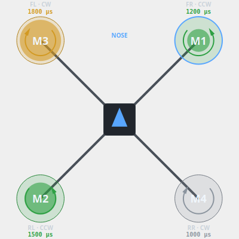
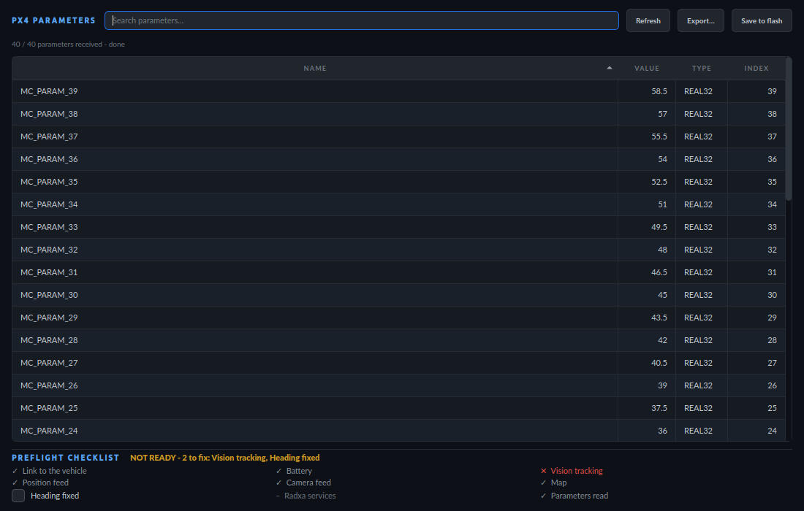

# Drone-GCS User Guide (`guide.md`)

A guide to the laptop-side Ground Control Station application (`drone_gcs.py`) — what it's built from, how it's organized, and how to use every workspace. This file covers the **GUI application only**. For installing/running the underlying ROS 2 / SLAM / PX4 pipeline, see [`setup.md`](setup.md). For the engineering history behind these features (why they exist, what bugs were found and fixed), see [`Progress.md`](Progress.md).

---

## Table of Contents

1. [What Drone-GCS Is](#1-what-drone-gcs-is)
2. [Launching It](#2-launching-it)
3. [Header & Connection Bar](#3-header--connection-bar)
4. [Workspaces](#4-workspaces)
   - [Cockpit (PFD)](#cockpit-pfd)
   - [Tactical SLAM](#tactical-slam)
   - [Motors / Actuators](#motors--actuators)
   - [FPV Camera Tab](#fpv-camera-tab)
   - [Diagnostics](#diagnostics)
   - [Terminal / Logs](#terminal--logs)
   - [Configuration](#configuration)
   - [Parameters](#parameters)
5. [Guided Confirm: The Safety Gate](#5-guided-confirm-the-safety-gate)
6. [Keyboard Shortcuts](#6-keyboard-shortcuts)
7. [Audio Alerts](#7-audio-alerts)
8. [Alarm Card & Video Health](#8-alarm-card--video-health)
9. [Look & Feel: Colour, Fonts, Short Windows](#9-look--feel-colour-fonts-short-windows)
10. [Range Test: How Far Does the Live Feed Run Without Packet Loss?](#10-range-test-how-far-does-the-live-feed-run-without-packet-loss)
11. [Radxa Services](#11-radxa-services-boot-start-watchdog-log-cleanup)
12. [Current Limitations](#12-current-limitations)

---

## 1. What Drone-GCS Is

`drone_gcs.py` is a PyQt5 desktop application that connects to the Pixhawk (via `mavlink-router`) and to the Radxa's SLAM/video pipeline, presenting live telemetry, a 2D tactical map with click-to-fly path planning, motor diagnostics, camera feeds, a standing alarm card, and a read-only parameter browser — all in one aviation-styled dark-mode window.

It's built in four layers:

```
scripts/gcs/
├── core/         # Data models & logic — no Qt, no MAVLink wire format
│   ├── telemetry.py         # TelemetrySnapshot: the single source of truth every widget reads
│   ├── execution_tracker.py # Confirms a command was physically executed, not just ACKed
│   ├── path_planner.py      # Obstacle-aware A* over the live occupancy grid
│   ├── param_codec.py       # PX4 parameter IEEE-754 bit-cast decode/format
│   ├── motor_range.py       # The vehicle's motor min/max/disarm/function → % and idle/high/saturated (one model for the station)
│   ├── alarms.py            # Prioritised, acknowledgeable alarm list (pure Python)
│   ├── video_health.py      # fps / pipeline latency / jitter / freeze detection
│   ├── ui_stall.py          # Detects the UI thread blocking (30 Hz tick overrun)
│   ├── log_bundle.py        # One-click zip of flight history + settings + logs
│   ├── settings.py          # Typed, validated, versioned settings (+ migrations)
│   ├── audio.py             # Spoken/tonal operator alerts (rate-limited, non-blocking)
│   └── health.py            # Worker liveness/latency bookkeeping
├── protocol/     # Transport — owns the live connections, emits Qt signals
│   ├── mavlink_worker.py     # QThread: MAVLink connection, telemetry decode, command dispatch, parameter reads
│   └── ros2_map_listener.py  # QThread: SLAM map over ROS 2, with a raw-TCP fallback
├── controllers/  # What the main window DOES, split out of drone_gcs.py (mixins)
│   ├── flight_commands.py    # arm / disarm / takeoff / yaw / altitude / mode / kill
│   ├── mission_control.py    # execute / pause / resume / abort path, collision & detour handling
│   └── alarm_control.py      # telemetry & video health → the alarm list
└── ui/           # Every visible widget, one file per concern
    ├── top_status_strip.py, hud_widget.py, slam_map_widget.py (input) + map_canvas_render.py (drawing),
    │ motor_widget.py, actuator_widget.py, value_grid.py, alarm_banner.py, mini_feed.py,
    │ video_feed_widget.py, params_tab.py, logs_tab.py, cli_console.py, sidebar_nav.py,
    │ guided_confirm.py, toast.py, styles.py, fonts.py, scaling.py, shortcuts.py, mission_progress.py, ...
```

The threads behind this (which one owns what, and which signals cross to the UI) are documented in [`docs/threading.md`](docs/threading.md).

A companion app, `radxa_monitor.py`, is a separate zero-control passive monitor meant to run on the Radxa itself or a field display — it is out of scope for this guide since it has no interactive features.

---

## 2. Launching It

```bash
./scripts/gcs/run_drone_gcs.sh
```
This sources ROS 2, forces the XCB Qt backend, and runs `drone_gcs.py`. No SSH or X11 forwarding is needed for real use — this runs directly on the laptop's own physical screen. See `setup.md` for getting the Radxa-side pipeline running first.

---

## 3. Header & Connection Bar

Two rows across the top of the window:

**Row 1** — branding, connection controls, Mode/Armed:
- **Network dropdown** (`HTIC_RND` / `DroneBridge5` / `DroneNet` / `Custom...`): picking a preset fills in the Radxa's IP for MAVLink, the TCP map bridge, and the FPV stream **all at once**. Port and Protocol are independent and keep whatever you last set (MAVLink's UDP:14550/TCP:5760 choice doesn't depend on which network you're on).
- **Connect / Disconnect** button — one control carries both the action and the current state (no separate redundant status badge).
- **Mode / Armed** badges, pinned top-right.

**Row 2** — live telemetry:
- Battery, VIO lock, EKF2 fusion badges.
- RX/TX telemetry throughput.
- VIO NED position readout.
- A transient notification **toast** lands in this row's own free space rather than floating over the workspace below it.

Under the header, **only while something is wrong**, a slim **alarm card** appears (see [§8](#8-alarm-card--video-health)).

---

## 4. Workspaces

Switch between workspaces with the left-hand vertical sidebar, or `Ctrl+1` through `Ctrl+9`.

**Camera thumbnail:** on the tabs that have no camera of their own — Motor Actuators, Diagnostics, Flight Terminal, Flight Logs, Configuration, Parameters — a small live thumbnail sits at the bottom of the rail, above the speed/altitude/mode footer, so the drone's view is never out of sight while you check or change something. Click it for fullscreen. A dot and word under it show `LIVE`, `SLOW`, `FROZEN`, `NO SIGNAL` or `NO VIDEO`; when the feed freezes the picture is **cleared**, never left up, so a dead frame cannot pass for a live one. It uses frames the one capture already decoded (about 10 fps, nothing while hidden) and only appears when the rail has room.

### Cockpit (PFD)
Deliberately minimal: just the **SPEED (m/s)** and **ALT AGL (m)** tapes plus a Mode/Armed banner, both driven by live Pixhawk telemetry (`ground_speed`/`altitude` from `LOCAL_POSITION_NED`). No artificial horizon, compass, or crosshair — that level of flight-attitude detail was deliberately removed in favor of the raw FPV feed itself.

**Control column** (right-hand side): ARM / DISARM / HOLD / LAND, then **Navigation** and **Flight Mode**, then one row holding the **servo button and EMERGENCY KILL**:

`● [ SERVO 0° → 90° ]  |  [ EMERGENCY KILL ]`

The servo is an ESP32-C3 + MG995 driven over WiFi **HTTP** (not MAVLink — it works whether or not the vehicle is linked). One press toggles 0°↔90° (first press from an unknown position goes to 0°), queued on the ESP32 so pressing while it moves is safe. The dot is grey idle / amber moving / red offline; the label reads `SERVO OFFLINE` when it can't be reached (click to retry); the IP and any error are in the tooltip. Set the address under *Configuration → ESP32 SERVO ACTUATOR*. The row is deliberately lopsided: kill gets 60% of the width, stays solid red, and sits behind a divider with a 16 px gap on each side; the servo stays neutral grey, so the two can't be mistaken for each other.

### Tactical SLAM
The primary situational-awareness view, with two switchable layers:
- **2D Blueprint & A\* Planner** — a top-down occupancy-grid canvas (`/map` raw and/or `/map_thin` skeleton, togglable), with an arrow-shaped drone icon whose heading smoothly interpolates toward the true VIO/EKF2 yaw (shortest-angle blending, no snap or wrap-around glitch at 359°→0°), a breadcrumb flight trail, and pan/zoom/rotate controls.
- **3D RViz2 Viewport** — a real embedded RViz2 window (X11 window swallowing) for the full point-cloud/SLAM 3D view, with **Launch / Reload / Close** controls.


**Layout.** The top bar is one row: the view switch (2D Map / 3D Cloud) followed by that view's tools (rotate, follow, centre, zoom, fit; Launch/Reload/Close for 3D). Under the map a thin **status strip** shows the vehicle's N/E position, heading, rotation, follow state and position uncertainty (it no longer sits on top of the map). Everything else is one narrow **side panel** on the right, top to bottom in the order you work:
- **MAP** — the map-status pill and **Reset Map** (plain grey; red only on hover). The pill is grey `NO DATA` until a map has arrived, `LIVE` when it flows, and red `MAP LOST` only if a live map stops.
- **LAYERS** (2D only) — *Raw / Thin / Both*, plus **Inflation**, **Keep-out** and **Measure** (blue when on).
- **ROUTE** — the staged goal or mission: where, how far, how many waypoints, estimated time; with more than one stop, a compact stop list (▲ ▼ ✕ to reorder/remove) that grows with the number of stops up to six rows.
- **CRUISE ALT**, then the **path actions**, large and shown only when they apply: **EXECUTE** while idle (greyed until a route is planned); **PAUSE/RESUME** and **ABORT** (red) while a path is flying or held.

The floating camera window opens over the map's **top-left** corner (the compass is top-right, the scale bar bottom-left); drag it anywhere.

The **›** button at the top of the panel folds it to a narrow strip that keeps only the path actions (stacked), giving the map the full width; **‹** brings it back.

**Click-to-navigate**: clicking anywhere on the 2D map stages a goal pose and runs the obstacle-aware A* planner over the live grid, drawing the route with distance/ETA. Shift+click adds more stops.
- **EXECUTE** — dispatches the drone through the computed waypoints in OFFBOARD mode, gated behind the slide-to-confirm bar (see [§5](#5-guided-confirm-the-safety-gate)).
- **PAUSE / RESUME** — halts in place (`AUTO.LOITER`) or resumes the remaining route.
- **ABORT** — cancels the active route and lands, also gated behind slide-to-confirm.
- **Reset Map** — wipes the live SLAM map and restarts mapping from empty, for when the map has drifted or accumulated garbage. Confirmation-gated (no undo) and **hard-disabled while armed**, since it would pull the EKF2 vision-fusion reference and any live obstacle data out from under an actively flying vehicle.
  > ⚠️ This is destructive and cannot be undone. Only use it while disarmed.
- **Dynamic collision re-check**: every 200ms during a flight, the remaining path is re-checked against the live grid; if an obstacle appears within 1.5m ahead, the GCS automatically engages `AUTO.LOITER` and computes a fresh A* detour.

**Map quality strip** (under the toolbar, once a map exists): coverage, explored, frontier, walls, squareness, obstacles. Grey-first — a number that passes (or has no threshold) is plain text; only one that **fails** its `map_eval` threshold turns amber, and the note beside it names which.

### Motors / Actuators
Heading: **ACTUATOR OUTPUTS & MOTOR TELEMETRY**, with a one-line status on the right (`ALL MOTORS OFF` / `IDLE` / `MOTORS ACTIVE · 62%` / `HIGH LOAD` / `SATURATION · M3 1850 µs`). Three cards:

- **Frame geometry** — a top-down drone: tapered arms, a body with a camera pod and LEDs (white front, red rear — the heading is the drawing itself, there is no "NOSE" label), motor hubs **M1–M4**, and propellers that **turn at a rate proportional to the output**, CW and CCW motors in opposite directions. Each rotor's tint follows its state, each has a rotation arrow beside it, and a caption `FR · CCW` / `1500 µs · 50%`. Click a rotor to select it for the bench test.
- **Per-motor gauges** — one bar per motor with its µs, percentage and position.
- **Bench Motor Test** — see below.

**Scaled to the vehicle's own motor range.** After connecting, the GCS reads `PWM_MAIN_MINn / MAXn / DISn / FUNCn` from the vehicle (single parameter reads; the Parameters tab is not disturbed). Percentages and the idle / high / saturated states are relative to *that* range — a 1100–1900 µs vehicle at full throttle reads 100 %, not 80 % — and `FUNCn` decides which output is which motor. The footer says `Scale: 1100–1900 µs (from vehicle)`, or `default 1000–2000 µs (vehicle range not read yet)` until it arrives. The same thresholds (idle ≤ 5 %, high > 75 %, saturated > 90 % of range) drive the diagram, the bars, the status line and the Diagnostics motor tiles, so they cannot disagree.

**It never presents the past as the present.** `SERVO_OUTPUT_RAW` arrives at 5 Hz; if it stops for about 2 s the bars and rotors grey out, the propellers stop turning, and the status reads `MOTOR DATA STALE · N s` or `NO MOTOR DATA`. During a bench test the *commanded* output is shown at once and labelled `COMMANDED` (a test-driven output may never appear in `SERVO_OUTPUT_RAW`); a live sample that confirms it takes over, and `COMMANDED · not yet confirmed` says when the vehicle hasn't reported it.

**Bench Motor Test** (`MAV_CMD_ACTUATOR_TEST`), gated on a live link, a disarmed and grounded vehicle, an expiring props-removed acknowledgement, and a throttle ceiling:
- an **interlock checklist** — `LINK`, `DISARMED`, `ON GROUND`, `PROPS OFF` — so you can see which condition is holding it locked (red only for armed/airborne);
- the **props-off** confirmation with a visible countdown (`locks in 0:47`) — it re-locks itself after 60 s;
- a **2×2 motor selector** laid out like the aircraft seen from above (front row on top), with rotation arrows;
- the **throttle slider**: a thick track with a large handle, ticks every 5 %, the 25 % ceiling in amber, and a label such as `8 / 25 % · 1080 µs` (what that throttle means *on this vehicle*). Press anywhere on it to jump there, drag to follow, mouse wheel and the **−/+** buttons step 1 %;
- **HOLD TO SPIN** (momentary — the vehicle stops it within 2 s of release), **SEQ 1→4** to verify motor order and rotation against the diagram, and **STOP ALL**.
Every stop path (hold-release, STOP ALL, the 60 s expiry, sequence advance) resets all channels to idle.

On a short window the page sheds detail rather than overlap: first the footnote, then the checklist becomes a one-line reason and the selector folds into one row of four; it comes back when there is room again.



### FPV Camera Tab
Connects to the onboard MJPEG stream (`http://<radxa_ip>:8080/video`) and displays the live D435i color feed, auto-reconnecting every 2s on a dropped or never-opened stream. Also supports a USB webcam, a synthetic test pattern, or a custom RTSP/HTTP URL (with per-source URL memory and RTSP transport/timeout options).

- **Fullscreen (⛶)**: every video view — the docked tab, and the floating/undocked window — has a fullscreen toggle. Press `Esc` or click anywhere to exit.
- No overlay is drawn on top of the video by default (no HUD ladder/crosshair/compass) — flight status lives in the header and the Cockpit PFD instead. An optional **Telemetry** toggle (off by default) shows mode, altitude, speed and battery in a small box on the picture, on screen only.
- **Snapshot** saves the current frame as a PNG; **Record** writes the feed to an MJPEG `.avi` (a red `● REC mm:ss` shows while recording). Both go to `~/.drone_gcs/video/` (or `$DRONE_GCS_HOME/video/`) with a timestamp name and use the frames the single capture already decoded — no second connection to the Radxa. Only real frames are saved (never the grey "no signal" placeholder), and the overlay is never burned in.
- **Graph** (off by default) shows the last 60 s of frame rate (blue) and pipeline latency (grey), so you can see whether a problem is a slow decay or sudden stalls.
- There is **no stream-quality picker**: the Radxa streamer takes its JPEG quality from a ROS parameter at start-up and offers no per-client option, so a control here would do nothing.
- **Latency under Wi-Fi stalls:** the capture thread hands the GUI only the newest frame — if the GUI is still busy, or a burst of old frames arrives when the link recovers, the stale ones are skipped rather than queued — and the Radxa streamer keeps its per-client send buffer small. (The streamer change takes effect once the updated `d435i_video_streamer.py` is on the Radxa and restarted.)
- A **health line** under the picture: `LIVE · 29 fps · pipeline 18 ms · jitter 4 ms`, or `DEGRADED`, `CONNECTING`, `FROZEN · no frame for 3.0 s`, `NO SIGNAL`. Grey while healthy, amber/red only when not. "pipeline" is the time from the capture thread reading a frame to it being painted *inside the GCS*; it excludes the camera, encoder and network, so it is an early warning, not true glass-to-glass latency. A frozen or dead feed also raises an alarm (§8).

### Diagnostics
Heading **TELEMETRY VALUES** (one line) and a single **Layout ▾** menu: *Max columns*, *Text size*, *Add or remove values…*, *Edit tiles (reorder / remove)*, *Reset to default*. Below it:

- A **glance strip** — the six things you must be able to read in one look: **Altitude, Ground speed, Battery** (with V and A under it), **Link, Mode** (with ARMED / DISARMED under it) and **Flight time**. Not configurable on purpose, so muscle memory works; it splits into two rows of three on a narrow window.
- **System cards** — one card per system (Link, Flight state, Power, Attitude, Position, Velocity, Vision / EKF2, Motors, RC link, GPS, Commands, Companion, Station) holding your chosen values for that system, packed into columns with no empty cells. Each card has a **health light** in its header: grey when nothing needs attention (the normal state), amber for caution, red for fault; hover it to see what.
- Each value is a quiet small-caps caption over a large number, the unit a size down. A thin bar at the left of a cell appears only when that value is in caution or fault.

**Grey-first colour:** healthy values are plain white; colour means something. Amber is caution (battery low, a saturated motor), red is fault (battery critical, a position feed that was flowing and stopped, no link); position is simply grey before any data arrives rather than a wall of red zeros. A stale motor feed shows `--`, not the last value.

**Max columns** is a maximum: the grid uses fewer when the window can't fit that many cards at their minimum width, so nothing is clipped or pushed off the right edge. You still choose, order and size the values from a registry of ~50 fields; a saved layout always wins over the default set.

### Terminal / Logs
- An embedded command console (`cli_console.py`) with history recall (`↑`/`↓`) for typing flight commands directly.
- A flight log viewer, with **Export CSV** and **Export Bundle**: one zip of the flight history, your settings, any `.log` / `.tlog` files and a manifest — attach it to a bug report as-is.
- **Reset Logs** button: password-gated (password: `admin`). Prompts for the password via a dialog before clearing the flight log file — the in-progress session's own state is left untouched.

**Flight Logs** (its own tab) lists every armed session — dates in ISO form (`2026-09-17 10:15:00`), modes left-aligned. Select a row and press **Details…** (or double-click) for that flight:
- six summary tiles (duration, distance, max altitude, max speed, battery start→end, voltage sag) and four charts — altitude, ground speed, battery %, battery voltage — with a hover read-out, plus the **ground track** (north up, scale bar, start/end marks);
- **Export this flight (CSV)** writes the time series (`t_s, altitude_m, speed_ms, battery_pct, voltage_v, north_m, east_m`).
- Flights recorded before this feature have no series; the dialog says so rather than drawing empty charts.

**Trends** (button at the foot) opens a panel of battery-health charts, one point per flight: **battery used per minute**, **voltage sag under load** and **flight duration**, each with its latest and average. A pack that is ageing shows as a slow upward drift in the first two. Flights shorter than 30 s are left out of the per-minute figure.

The series is sampled about once a second while armed (an hour at most, then thinned), in `flights.jsonl` beside the summary fields.

### Configuration
A section list on the left (Drone profile, MAVLink connection, Video & map bridge, SLAM & navigation, Command limits, Alert thresholds, Display, Audio alerts, ESP32 servo actuator) and one card per section on the right.
- **Search** filters every field by its caption.
- Units are a suffix after the box (`m`, `s`, `%`, `mAh`), not part of the label. Every field has a plain-language caption.
- A blue **●** marks a field that differs from what is saved, and the footer counts **N unsaved changes**.
- **restart needed** appears beside a changed field that is only read at start-up. Command limits, alert thresholds, audio, the ESP32 address and the FPV stream URL apply the moment you save; everything else needs a restart.
- **Inline validation**: a bad value outlines its field in red with the reason under it (a number that isn't, a critical battery level above the warning level, …), and **Save Settings** stays disabled until it is fixed.
- **Reset section** puts one card back to defaults (not saved until you Save).
- **Preset** (*Bench* / *Indoor flight*) fills in the few values that differ between those two situations — it saves nothing until you press Save. There is no outdoor preset: the vehicle is indoor and vision-only.

### Parameters
*(Ctrl+9)* — a live PX4 parameter table: search box, sortable columns (Name / Value / Type / Index), populated via the standard MAVLink parameter protocol (`PARAM_REQUEST_LIST` / `PARAM_VALUE`). Values are decoded through the same IEEE-754 bit-cast logic used elsewhere in this project for reading typed PX4 parameters correctly (an int32 param read as a naive float produces nonsense like `1.4e-45`).

- **Export…** saves the parameters shown to a `.params` file (same layout as `Drone_1.5.params`, sorted by name) — use it to take a fresh backup after any change, so the file in the repo does not go stale.
- **Save to flash** asks the flight controller to write its *current* parameters to flash so they survive a power cycle (`MAV_CMD_PREFLIGHT_STORAGE`). It needs a link, refuses while armed, and sits behind the slide-to-confirm bar. It changes no value — it stores what is there.
- **Still read-only for values** — writing a single parameter from this tab (with a readback and the same guarded-confirm as ARM) is not built.

**Preflight checklist** (under a horizontal rule below the table). One line per check, three to a row: Link, Battery, Vision tracking, Position feed, Camera feed, Map, **Heading fixed** (a tick box *you* tick after turning the drone once; it clears itself whenever vision tracking is lost, because the heading has to be fixed again after every restart), Radxa services, Parameters read. `✓` quiet grey = fine, `✕` red = a required check failed, `–` amber = cannot tell (never counted as fine). The heading line reads **READY TO ARM** or **NOT READY – 2 to fix: …**.

**It blocks ARM.** While any *required* check is not fine, the ARM button refuses and says which ones (toast + console); details are in this tab. Not required (shown for information): Radxa services, Parameters read. Two ways round it, both deliberate: type `arm force` in the flight terminal (the bench override, as before), or untick *Configuration → Command limits → Block ARM until the preflight checklist passes*.



---

## 5. Guided Confirm: The Safety Gate

Every irreversible action (arm, disarm, emergency kill, abort path) and every numeric dispatch (takeoff altitude, yaw, relative move) is gated behind a **slide-to-confirm bar** rather than a click or a modal dialog whose default button is one accidental `Return` away — QGroundControl-style. The bar floats directly **above the button that triggered it** (falling back to below if there isn't enough headroom), and follows the window if it's resized while showing. Nothing is dispatched until the operator actually drags the slider through; the confirm bar itself has no execution logic of its own — the main window still runs the exact same command method either way.

---

## 6. Keyboard Shortcuts

Press **F1** at any time for the full shortcut overlay, generated live from the same binding table the app uses. Workspaces switch with `Ctrl+1` through `Ctrl+9` (Cockpit, Tactical SLAM, Motors, FPV, Diagnostics, Terminal, ..., Parameters). No destructive action fires directly from a bare key — arm, disarm, and abort all open the guided-confirm bar, and emergency kill has no keyboard binding at all.

---

## 7. Audio Alerts

Spoken and tonal alerts for key events (arm/disarm, command rejection, connection loss) run on a background daemon thread through a bounded queue, so a wedged sound device can never block the GUI. Tones are synthesized once and played via `aplay`; speech goes through `spd-say`; a machine with neither degrades silently rather than failing. Alerts are rate-limited per event — PX4 re-runs its preflight checks every ~2s, and an alert that repeats forever is one the operator just mutes. Audio is *edge-triggered* (it speaks once); the alarm card (§8) is its *standing* counterpart.

---

## 8. Alarm Card & Video Health

A slim card under the header that is **hidden while nothing is wrong**, so it costs no cockpit space in normal flight. When there is an alarm it shows the highest-priority one: a severity bar and badge, a bold title, a grey hint line (e.g. *"Check the stream URL and that the camera streamer is running."*), **how long it has been active** as a running `m:ss`, a `+N` count for others, and **Acknowledge**.

| Alarm | Level | When |
|---|---|---|
| Link lost | CRITICAL | telemetry stopped — only after the link has been up once (not at startup) |
| Battery critical / low | CRITICAL / WARN | at or below the configured thresholds |
| Vision lost | CRITICAL | no VIO / vision fusion **while airborne** |
| Position feed lost | CRITICAL | no local position **while airborne** |
| Video feed frozen / no signal | WARN | the camera stream stopped delivering frames |
| Map stalled | WARN | the map was arriving and has stopped for longer than *Map stalled after* (Configuration → Alert thresholds). Not raised before the first map or after a deliberate Reset Map |
| Screen froze | WARN | the 30 Hz UI tick overran by 0.5 s or more; held for 10 s |
| Radxa pipeline down | CRITICAL | the Radxa watchdog reports the camera/SLAM pipeline failed, or it gave up restarting it |
| Radxa pipeline is stopped | WARN | the pipeline is stopped (e.g. on purpose, or not started yet) |
| Radxa pipeline was restarted | WARN | the watchdog had to restart it in the last 5 minutes (the reason is in the detail line) |
| Radxa disk almost full | WARN | under 10 % free on the Radxa |

- Red = unacknowledged CRITICAL, amber = unacknowledged WARN, neutral grey once acknowledged (with an `ACKNOWLEDGED` tag). **Acknowledging does not clear an alarm** — only the condition going away does; an acknowledged alarm that gets worse becomes unacknowledged again.
- Alarms are *level-triggered*: each condition holds its alarm for exactly as long as it is true, so the card always answers "what is wrong right now". A new or escalated alarm also writes a console line (and a toast for CRITICAL). It adds no sound of its own — the audio alerts already cover link, battery and vision.
- The video row comes from the FPV health monitor (§4). Map and screen-freeze alarms are the station's own health; the Radxa rows come from the watchdog (§11) and simply do not appear if the Radxa is not running it.

---

## 9. Look & Feel: Colour, Fonts, Short Windows

- **Colour carries meaning.** The station is grey-first: strong colour appears only for a real state or problem. Armed is **green** and disarmed is **red** everywhere (header, navigation footer, Diagnostics) — as a *state*, so a resting disarmed vehicle never raises a health light or a side bar.
- **Fonts.** `DRONE-GCS` is set in **Red Hat Display**; every heading — Navigation, Flight Mode, each tab's section and card headings, the diagnostics group titles — in **Ubuntu**. Body text, numbers, buttons, the console and the sidebar tab names are unchanged. Both families ship in `assets/fonts/` (with their licences) and are loaded at startup, so they render on any machine without installing anything; a missing file falls back to the old font rather than breaking.
- **Short windows.** At the smallest supported window and the largest UI scale (with the alarm card showing and the vehicle armed — the tallest case) the layout tightens instead of overlapping: the navigation rail tightens its rows, the Motors page drops its footnote and folds its checklist, and the camera thumbnail hides when it would not fit. The layout test suite runs every page at every size and scale, and a second time in exactly that tallest state.

---

## 10. Range Test: How Far Does the Live Feed Run Without Packet Loss?

A walk-away test for the camera-feed Wi-Fi link. Put the Radxa and router together,
carry the laptop away from them, and the tool finds the furthest distance at which
the feed loses **no packets** and does not stall.

```
cd ~/Flop/scripts/diagnostics
python3 link_range_test.py
```

A window asks for the Radxa's IP address (it remembers the last one), shows which Wi-Fi network the laptop is on, can check the connection, and lets you choose how to measure:

**Continuous walk** *(simplest)* — press **Start walking**, walk away at your own pace, and one line of values streams every second (signal, ping loss, video fps, longest gap between frames, UDP loss, ok / LOSS). Press **Stop** when you are done. The result is in **seconds and dBm — there is no distance**: *"loss-free for the first 42 s, down to −68 dBm; first loss at 43 s (−71 dBm): video stall 1.8 s"*, plus a table of how often each 5 dB signal band was clean. Terminal: `python3 link_range_test.py --cli --radxa <ip> --walk --udp --start-helper radxa@<ip>` (Enter stops it; `--walk-seconds 120 --auto` runs unattended).

**Hold at marked distances** — the original, with a walking screen:

1. Stand next to the Radxa and press **Measure here (0 m)**, then stand still for the countdown.
2. Walk to a measured spot (tape or floor tiles), type the distance if it is not the suggested one, press **I'm at the mark**, and stand still again. Repeat further out.
3. Press **Finish and show result**. The answer comes first: *live feed with no packet loss up to N m*, then a table per distance and a full report (`report.html`, with charts) saved under `~/link_range_results/`.

It measures the laptop's Wi-Fi signal and retries, ping loss and round-trip time, the
real MJPEG stream (frames per second, stalls, reconnects), and UDP packet loss in each
direction. The laptop must be on the **same Wi-Fi network as the Radxa**. The packet-loss probe needs
SSH access to the Radxa (`ssh-copy-id radxa@<ip>` once); it copies a small helper to
`/tmp` on the Radxa and stops it afterwards. "No loss" means exactly that by default;
raise *Allowed loss* under Advanced options to tolerate a little.

`python3 link_range_test.py --demo` (or `--demo --walk`) shows a sample report from synthetic data, and
`python3 link_range_test.py --cli --radxa <ip> --udp --start-helper radxa@<ip>` runs it
from the terminal with no window. How every number is defined and calculated, and what the
test cannot tell you: [`docs/link_range_test.md`](docs/link_range_test.md).

---

## 11. Radxa Services (boot start, watchdog, log cleanup)

Three small services on the Radxa, installed from `scripts/radxa/` (source of truth in this repo; copy with the normal Radxa update, then install once):

| Service | What it does |
|---|---|
| `drone-pipeline` | starts the camera / SLAM / video / map pipeline (what `camera.sh` does by hand) **at boot**, and restarts it if it crashes — at most 5 failed starts in 5 minutes, then it stops trying |
| `drone-watchdog` | every 5 s checks that the pipeline is running **and the video streamer is really serving frames**, that `mavlink-router` is running, and the disk; restarts what is stuck; serves a read-only status at `http://<radxa>:8081/status` which the GCS turns into alarms and the checklist row |
| `drone-janitor` (daily timer) | stops the logs filling the disk (see below) |

```
# on the Radxa, once (needs sudo):
sudo ~/Flop/scripts/radxa/install_radxa_services.sh            # enable at boot; the pipeline is NOT started now
sudo ~/Flop/scripts/radxa/install_radxa_services.sh --start    # ...and start it now
sudo ~/Flop/scripts/radxa/install_radxa_services.sh --uninstall

# day to day
systemctl status drone-pipeline drone-watchdog
journalctl -u drone-pipeline -f            # the pipeline's own output (replaces watching camera.sh)
curl localhost:8081/status                 # what the GCS sees
sudo systemctl stop drone-pipeline         # stop it on purpose - the watchdog will NOT restart it
python3 ~/Flop/scripts/radxa/radxa_log_janitor.py          # dry run: lists what the cleanup would remove
```

**Watchdog rules.** It restarts the pipeline if video has not been served for 20 s after the pipeline has been up for at least 90 s (a freshly started pipeline gets that long to bring SLAM and the camera up), or if the unit has *failed*. It never starts a pipeline you stopped yourself, and it gives up after 3 restarts in 10 minutes rather than looping (state `down`, which the GCS shows as a CRITICAL alarm). A pipeline you start by hand with `camera.sh` still counts as alive if it serves video.

**Log cleanup (dry run unless `--apply`; the daily timer applies).** Removes ROS logs older than 14 days — dated folders under `~/.ros/log` *and* the per-node files such as `stereo_odometry_<pid>_<time>.log`, which are most of the space — but always keeps the newest 20 folders / 50 files and anything touched in the last 24 h; stricter (3 days) when under 15 % disk is free. `mav.tlog` / `mav.tlog.raw` over 50 MB are compressed to a dated `.gz` and emptied in place; old `.gz` beyond the newest 10 and 30 days go. It touches nothing else.

**Not yet done:** the services have been installed and the unit started/stopped on the real Radxa, but with **no RealSense attached** at the time — so a *full* start with live video, a real crash/restart and a reboot have not been seen.

---

## 12. Current Limitations

- The **Parameters tab** cannot change a value (no write-then-verify, no guided-confirm gate for reboot-required parameters yet) and has only been tested against a synthetic parameter burst. **Save to flash** has been tested against a mocked link only — it has never been sent to the real flight controller, so check afterwards (power-cycle and Refresh) that the values stuck.
- The **preflight checklist** and the ARM gate have only been exercised on the bench with synthetic state; the exact checks (for example the battery threshold) are defaults to be tuned with real flights.
- The **motor scale** (`PWM_MAIN_*`) is read with single parameter reads that have not been tried against the real vehicle; if they never arrive the default 1000–2000 µs range is used and the footer says so. Only outputs 1–4 are covered (all `SERVO_OUTPUT_RAW` carries here).
- The **alarm card** covers link, battery, vision, position, video, map, screen freezes and the Radxa watchdog's report. The map-stalled trigger is the existing *Map stalled after* setting; no other thresholds were guessed.
- The **servo** talks plain HTTP to the ESP32 with no authentication, and nothing stops it being pressed while the vehicle is flying.
- The **range test** has been verified on this laptop's Wi-Fi card, on loopback and in its window on a virtual display — not yet against the real Radxa or on a real walk.
- The **low-latency streaming changes** (small send buffer, one write per frame, newest-frame-only GUI hand-off) are tested on loopback only; whether they reduce freezes on the real Wi-Fi link has not been measured — run the range test before and after.
- **Video recording / snapshots** and the **flight detail charts** were checked offscreen and with synthetic data only; recording has not been run against the live Radxa stream.
- No fullscreen support outside the video views (map/RViz remain windowed within their tab).
- Everything above was checked offscreen / on the bench; no real flight has happened.

See [`Progress.md`](Progress.md)'s Known Issues & Roadmap section for the complete, up-to-date list across the whole project, not just the GUI.
