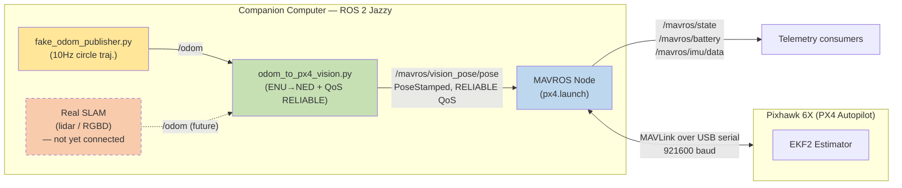
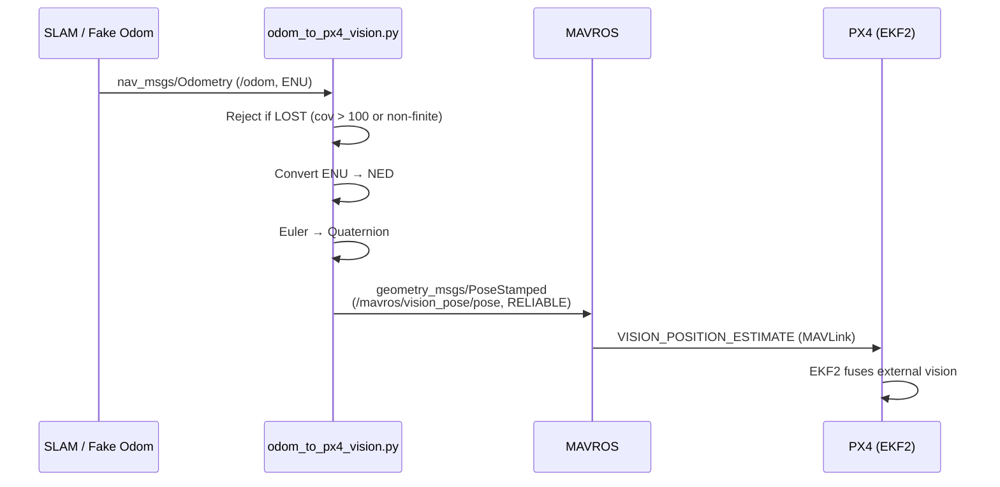
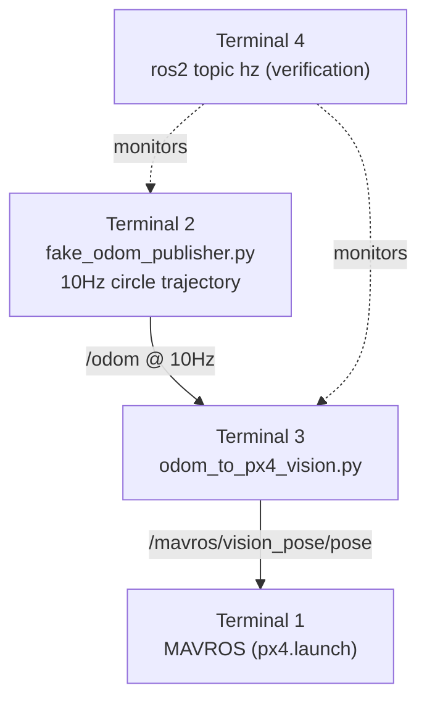

# Pixhawk 6X – MAVROS / ROS 2 Jazzy Integration
### Work Log — 31 August 2026

---

## 1. Summary

Brought up a live MAVLink ↔ ROS 2 bridge between a Pixhawk 6X flight controller and a ROS 2 Jazzy companion computer using MAVROS, verified telemetry, adapted an existing Gazebo-based SLAM→EKF2 vision injector for real hardware, and validated the full pipeline end-to-end with a synthetic odometry source.

| # | Task | Status |
|---|------|--------|
| 1 | Serial link to Pixhawk 6X | ✅ Done |
| 2 | MAVROS bridge (px4.launch) | ✅ Done |
| 3 | Telemetry topic checks | ✅ Done |
| 4 | Topic rate verification | ✅ Done |
| 5 | Raw MAVLink inspection | ✅ Done |
| 6 | Vision injector: UDP → MAVROS-relayed | ✅ Done |
| 7 | QoS mismatch fix | ✅ Done |
| 8 | `use_sim_time` flag removed for hardware | ✅ Done |
| 9 | `/odom` source (real SLAM) | 🟥 Blocked — no sensor hardware yet |
| 10 | Fake odom test tool | ✅ Built |
| 11 | End-to-end pipeline test | ✅ **Executed and passed** |

---

## 2. System Architecture (as built today)



---

## 3. Serial Connection to Pixhawk 6X

Identified the flight controller as a PX4-based board (Auterion PX4 FMU v6X) and connected MAVROS directly over USB serial.

```bash
ls -l /dev/serial/by-id/
# usb-Auterion_PX4_FMU_v6X.x_0-if00 -> ../../ttyACM0

ros2 launch mavros px4.launch \
  fcu_url:=serial:///dev/serial/by-id/usb-Auterion_PX4_FMU_v6X.x_0-if00:921600
```

**Result:**
```
CON: Got HEARTBEAT, connected. FCU: PX4 Autopilot
```

| Item | Detail |
|---|---|
| Board | Auterion PX4 FMU v6X |
| Transport | USB serial, `/dev/serial/by-id/...` |
| Baud rate | 921600 |
| Plugin load | Full set loaded, no failures |
| Follow-up flag | Timesync RTT ~892 ms — noted, not blocking |

---

## 4. Telemetry Verification

| Topic | Field(s) checked | Result |
|---|---|---|
| `/mavros/state` | `connected`, `armed`, `mode` | `connected: true`, `armed: false`, `mode: AUTO.LOITER` |
| `/mavros/battery` | `voltage`, `current` | ~65.5 V, ~0.01 A — steady |
| `/mavros/battery` | `percentage`, `capacity` | `NaN` — expected; no battery capacity param set in QGC yet |

---

## 5. Rate Checks & Raw MAVLink Inspection

```bash
ros2 topic hz /mavros/battery
ros2 topic hz /mavros/state
ros2 topic hz /mavros/imu/data

ros2 topic echo /mavlink/from   # raw messages FROM the FCU
ros2 topic echo /mavlink/to     # raw messages TO the FCU
```

- Publish rates are set by PX4's own MAVLink stream config — MAVROS only republishes what PX4 sends.
- Raw serial dump (`xxd`) and `mavproxy` documented as fallback tools for isolating transport-layer vs. MAVROS-layer issues.
- **Note:** MAVROS and a second raw connection cannot hold the same serial port simultaneously.

---

## 6. Vision Injector: Adapted for Real Hardware

The original script was built for **Gazebo SITL**: it opened its own `pymavlink` UDP connection and sent `VISION_POSITION_ESTIMATE` directly, bypassing MAVROS. On real hardware, MAVROS already owns the one available serial port — a second raw connection would conflict.



### 6.1 Changes made

| Change | Before (Gazebo/UDP) | After (Hardware/Serial-safe) |
|---|---|---|
| Transport | `pymavlink` UDP connection (own link) | ROS topic `/mavros/vision_pose/pose`, relayed by MAVROS |
| Port ownership | Own MAVLink connection — conflicts with MAVROS on serial | No new port opened — reuses MAVROS's existing link |
| Message | `VISION_POSITION_ESTIMATE` sent directly | `PoseStamped` published, MAVROS forwards it |
| Orientation | Roll/pitch/yaw floats | Quaternion (`euler_to_quat` added) |
| Unchanged | ENU→NED math, LOST-frame guard, stale-odom watchdog | Same |

### 6.2 QoS mismatch — found and fixed

```
[WARN] New subscription discovered on topic '/mavros/vision_pose/pose',
requesting incompatible QoS. No messages will be sent to it.
Last incompatible policy: RELIABILITY
```

**Cause:** MAVROS's subscriber requires `RELIABLE` QoS; the injector's publisher was `BEST_EFFORT`.
**Fix:** Publisher reliability changed to `RELIABLE` to match. (`/odom` subscription QoS left as `BEST_EFFORT` — only needs to match the SLAM publisher, not MAVROS.)

### 6.3 `use_sim_time` flag

`--ros-args -p use_sim_time:=true` is a **Gazebo-only** setting (syncs to a `/clock` topic the simulator publishes). On real hardware nothing publishes `/clock`, so the node's clock stalls and silently breaks rate-limiting and the stale-odom watchdog. **Removed for hardware runs.**

---

## 7. End-to-End Pipeline Test — Executed and Passed

Four-terminal test using a synthetic odometry source, since no SLAM sensor hardware is connected yet.



### 7.1 Terminal-by-terminal run steps

Run in this order — Terminal 1 must be up and connected (`Got HEARTBEAT`) before starting Terminal 3.

**Terminal 1 — MAVROS (start first, wait for heartbeat)**
```bash
ros2 launch mavros px4.launch \
  fcu_url:=serial:///dev/serial/by-id/usb-Auterion_PX4_FMU_v6X.x_0-if00:921600
```
Wait for:
```
CON: Got HEARTBEAT, connected. FCU: PX4 Autopilot
```

**Terminal 2 — fake odometry source (start second)**
```bash
python3 fake_odom_publisher.py
```
Confirms with:
```
[INFO] [fake_odom_publisher]: Publishing fake /odom (circle trajectory) at 10 Hz
```

**Terminal 3 — vision injector (start third, after /odom is live)**
```bash
python3 odom_to_px4_vision.py
```
No `use_sim_time` flag on real hardware. Startup log:
```
[INFO] [odom_to_px4_vision]: EV injector: '/odom' -> '/mavros/vision_pose/pose'
(ENU->NED, via MAVROS vision_pose plugin). Set SIM_GZ_EN_ODOM 0 to use it.
```
Then periodic confirmation every 60 messages:
```
[INFO] [odom_to_px4_vision]: EV #4800  NED x=0.34 y=-0.94 z=-0.50 yaw=-160.0 deg
```

**Terminal 4 — verification (run both, one at a time or in split panes)**
```bash
ros2 topic hz /odom
ros2 topic hz /mavros/vision_pose/pose
```
Expected output on `/mavros/vision_pose/pose`:
```
average rate: 10.000
    min: 0.092s max: 0.108s std dev: 0.00046s window: 6693
```

**Shutdown order:** Ctrl+C Terminal 4 checks first (just monitoring, order doesn't matter), then Terminal 3 (injector), then Terminal 2 (fake odom), then Terminal 1 (MAVROS) last so the FCU link closes cleanly.

### 7.2 Results

| Check | Result |
|---|---|
| `/odom` publish rate | 10 Hz, confirmed via `fake_odom_publisher.py` log |
| `/mavros/vision_pose/pose` rate | **Steady 10.000 Hz average**, across 6800+ message window |
| Jitter | std dev ≈ 0.0005 s — very tight, no drops, no drift |
| ENU→NED correctness | Cross-checked against circular trajectory — x, y, yaw rotate together consistently across 6600+ `EV #` log samples |
| Pipeline verdict | **Stable end-to-end.** Ready to swap fake source for real SLAM — no further changes needed to injector or MAVROS config |

Sample verification output:
```
average rate: 10.000
    min: 0.092s max: 0.108s std dev: 0.00046s window: 6693
```

Sample injector log (confirms math correctness, not just data flow):
```
EV #4740  NED x=1.00  y=-0.02 z=-0.50 yaw=-91.2 deg
EV #4800  NED x=0.34  y=-0.94 z=-0.50 yaw=-160.0 deg
EV #4860  NED x=-0.75 y=-0.66 z=-0.50 yaw=131.3 deg
```

### 7.3 FCU event log noise — reviewed, not a fault

MAVROS logged a continuous stream of PX4 `EVENT` messages at `ERROR`/`WARN` severity during the test:

```
[ERROR] [mavros.sys]: FCU: EVENT 16642797 with args -126-209-126-0-17-0-...
[WARN]  [mavros.sys]: FCU: UNK(8): EVENT 11047904 with args -0-0-0-18-1-128-...
```

**Assessment:** MAVROS logging unrecognized/unhandled PX4 event IDs (`UNK(8)` = unknown event type 8) at elevated severity by default. Telemetry and vision-pose forwarding remained fully functional throughout — **cosmetic log noise, not a pipeline fault.**

---

## 8. Open Items for Next Session

| Priority | Item |
|---|---|
| High | Attach real sensor hardware (2D lidar or RGBD camera) and bring up SLAM (`lidar_slam.launch.py` / `rgbd_imu_slam.launch.py`) to replace the fake publisher |
| High | Set PX4 EKF2 params for external vision fusion (`EKF2_EV_CTRL`, `EKF2_GPS_CTRL`, `EKF2_HGT_REF`, `EKF2_MAG_TYPE`, `SIM_GZ_EN_ODOM=0`) once real SLAM is live |
| Medium | Configure battery capacity in QGroundControl so `/mavros/battery` reports a real percentage instead of `NaN` |
| Low | Investigate elevated timesync RTT (~892 ms) on the USB serial link if timing-sensitive control is planned |
| Low | Consider suppressing/reclassifying the `UNK(8)` FCU event log spam if it clutters real flight logs |
